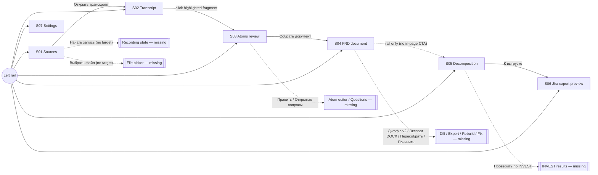
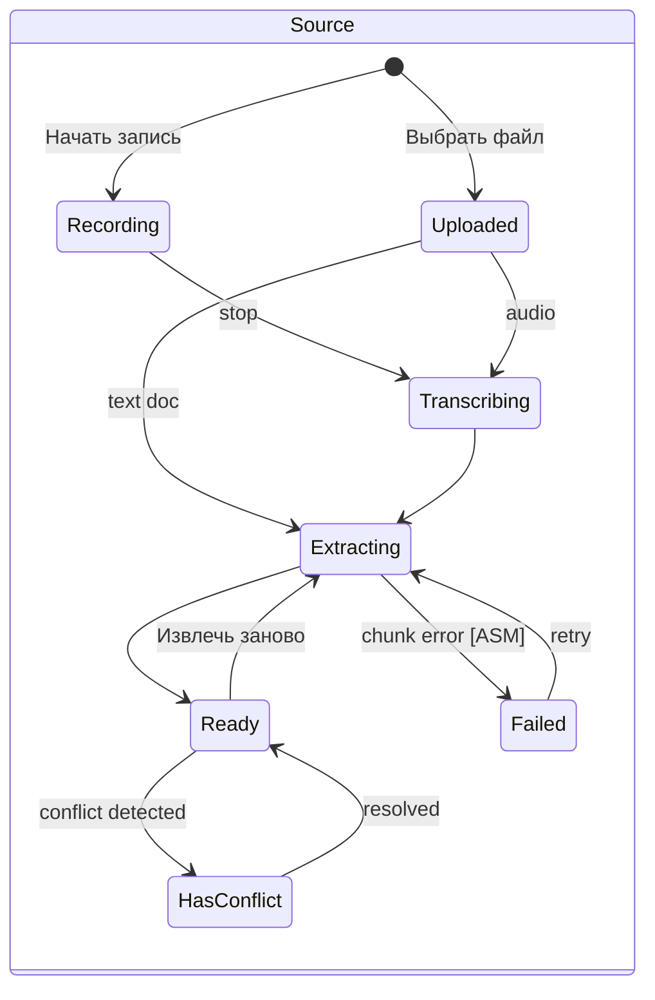
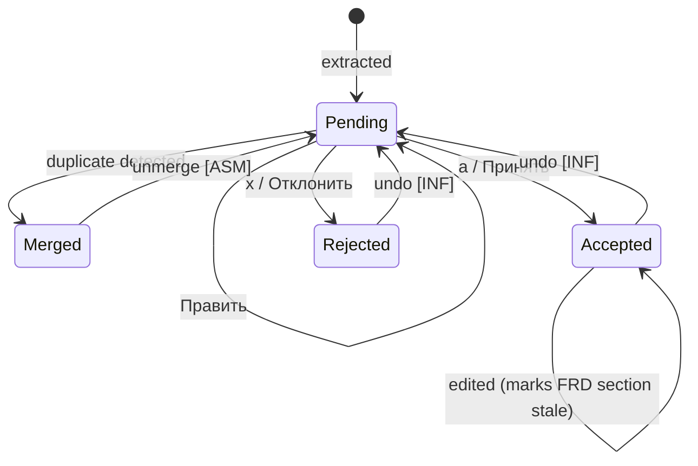
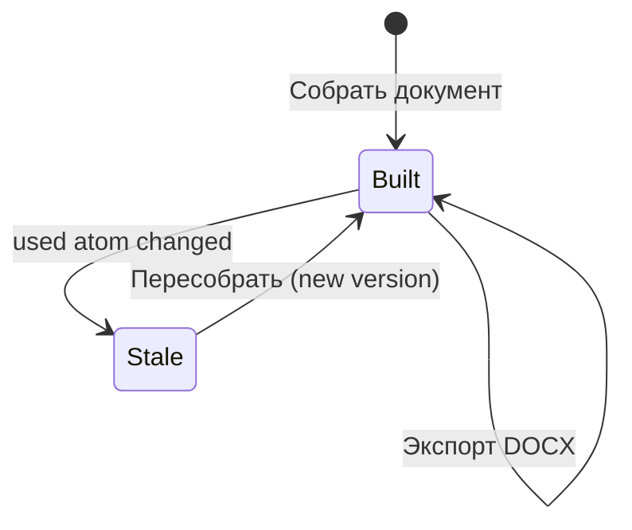
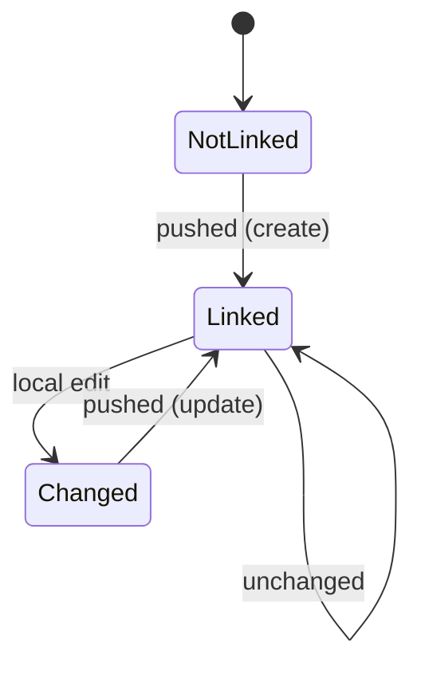

# Requirements Workbench — Requirements Specification
Version: 0.4 (prototype + existing codebase + PO interview + platform/installation decisions) · Date: 2026-09-23 · Status: Draft, the high-priority questions are answered

## 0. Document notes
- **Source artifacts:**
  - `docs/prototype/ba-helper-prototype.html` (copy of `~/prototype/ba-helper-prototype 3.html`): a single-file HTML/CSS/JS clickable prototype. UI language is Russian; brand "Requirements workbench · локально · v0.1".
  - **Existing application `heidurrus/gigaam-transcriber`** (https://github.com/heidurrus/gigaam-transcriber, analysed at commit `74d3289` "various bugfixes (mic not working etc.)"). The prototype is a revised, enhanced version of this app. **Development starts from this codebase.** See §1.5 and §12.
- **Method:** reverse-engineered from the prototype and the existing code. Every requirement carries a confidence tag:
  - `[OBS]` observed — visible in the UI or implemented in the prototype's JS;
  - `[BASE]` already implemented in the existing gigaam-transcriber app (reuse or extend, don't rebuild);
  - `[INF]` inferred — strongly implied by the evidence;
  - `[ASM]` assumed — a default filled in where the prototype and code are silent (each one is also an open question);
  - `[CONF]` confirmed by the product owner in the interview of 2026-09-23 (decisions D-01…D-17, see §13 and `docs/requirements/requirements-workbench-brief.md`).
  - A requirement can carry two tags, e.g. `[OBS][BASE]` = shown in the prototype and already in the code.
- **Sample data caveat:** the prototype is populated with an example client project ("CRM для контакт-центра" — CRM for a contact centre). That content (caller card, 2-second load time, 20% AHT goal) is **sample data the tool processes**, not requirements for the tool itself. It is used here only to understand the data shapes.
- UI labels are quoted in Russian as they appear, with an English translation.
- **Summary counts:** 7 screens · 67 FRs (10 already partly or fully in the baseline) · 34 NFRs · 18 business rules · 27 gaps · 17 PO decisions · 14 open questions (0 high).

---

## 1. Context

### 1.1 Product understanding
Requirements Workbench is a **local-first assistant for business analysts**, built as the next version of the existing GigaAM Transcriber app (§1.5). It turns raw elicitation material (recorded calls with the customer, audio files, transcripts, emails, earlier specifications) into managed requirements, then into a backlog:

**capture → transcribe (local ASR + speaker diarization) → extract "requirement atoms" with an LLM → BA reviews atoms → assemble an FRD document → decompose it into epics/stories/sub-tasks → export to Jira.**

The one idea that runs through every stage is **end-to-end traceability**: each atom keeps the quote, timestamp and speaker it came from; each FRD statement lists its source atoms; each story links to its FRD section and FR; each Jira issue gets the spec link and the source quote. The LLM proposes and the human decides. Nothing reaches Jira without an explicit confirmation.

### 1.2 Business goals (inferred)
| # | Goal | Evidence | Confidence |
|---|---|---|---|
| G1 | Cut the time a BA spends turning meetings into documented requirements | Whole pipeline; "много мелких вызовов, дёшево" (many small cheap calls) | [INF] |
| G2 | Make every requirement traceable to its source statement | Quotes/timestamps on atoms, "из атома, 2 источника" (from atom, 2 sources), Jira note "ссылка на пункт спецификации и цитата-источник" (link to the spec item and the source quote) | [OBS] |
| G3 | Catch contradictions and weak requirements early | Conflict notice (2 s vs 5 s), "NFR-3 не прошёл проверку качества: «быстро» без метрики" (NFR-3 failed the quality check: "fast" with no metric), INVEST check | [OBS] |
| G4 | Keep confidential client audio on the analyst's machine where possible | "локально" (local) label, local GigaAM transcription, keys in `.env`, Ollama option | [INF] |
| G5 | Produce documents in organisation- or standard-specific formats | Custom skill `write-frd-gost` (GOST-style FRD), pluggable skills folder | [INF] |

### 1.3 User roles
| Role | Description | Evidence | Confidence |
|---|---|---|---|
| Business analyst (primary, single user) | Records/imports sources, reviews atoms, builds the FRD, decomposes, exports to Jira, configures models | Every screen; local install; `.env` keys | [INF] |
| Tool administrator / power user | Installs dependencies (ffmpeg, GPU, Ollama), manages API keys, adds custom skills | Settings → Окружение (Environment), Скиллы (Skills) | [INF] (probably the same person as the BA) |
| Call participants (customer stakeholders) | External people whose voices are recorded and who appear as "Спикер N" (Speaker N) | Transcript, diarization | [OBS] (not system users) |
| Jira project stakeholders | Consumers of the exported issues | Export preview | [INF] (not system users) |

`[CONF]` D-01: **single user in v1, team-ready later.** No login or roles in v1, but the data model must allow later sharing and sync (NFR-MAINT-02).

### 1.4 Scope
**In scope (seen in the prototype)**
- Project context (one active project shown)
- Recording calls (system audio + mic), importing files
- Local speech recognition with model choice and speaker diarization
- Background processing with chunk progress
- Transcript viewer with audio playback and highlighted atom sources
- LLM extraction of typed requirement atoms, de-duplication, cross-source conflict detection
- Atom review (accept / edit / reject, filter by type, keyboard shortcuts)
- FRD assembly from accepted atoms and free-text blocks, versioning, diff, staleness detection, rebuild, quality check, DOCX export
- Decomposition into epics/stories/sub-tasks with acceptance criteria, INVEST check
- Jira export preview (create / update / unchanged / skip) and push
- Settings: environment checks, model per pipeline stage (cloud or local), pluggable skills

**Out of scope / not shown (confirm with the product owner)**
- Multi-user work, sharing, comments, approvals: **later**, not v1 (D-01); v1 data model must not block it
- Jira Data Center / Server (D-05: Cloud only through the Atlassian Remote MCP)
- Editing generated document prose directly (D-07)
- Editing screens for atoms, document text and stories (buttons exist, screens don't; Q-07)
- Open-questions register screen (button exists; Q-08)
- Conflict resolution screen (Q-06)
- Export targets other than Jira and DOCX (Confluence, Markdown, Azure DevOps…)
- Two-way sync from Jira back to the workbench (Q-12)
- Licensing, telemetry, auto-update

### 1.5 Baseline: the existing gigaam-transcriber app
The workbench is an evolution of **GigaAM Transcriber**, a working local app by the same author. It covers roughly stage 1 of the pipeline: capture + transcription. Stages 2–6 (atoms, FRD, decomposition, Jira) are new.

**What the baseline is**
| Aspect | Baseline implementation | Evidence |
|---|---|---|
| Form factor | Local Python app. A Flask server on `127.0.0.1:5000`, shown in a **pywebview desktop window** by default; `--browser` mode serves it to Chrome/Edge. Desktop window packaged for Windows only; macOS desktop recording lacks system audio (gap #25). **Target:** desktop app on both Windows and macOS (FR-PLAT-01/02) | `app.py` `__main__`, `launcher.bat`, `launcher-browser.bat` |
| Backend | `app.py` (~580 lines): Flask routes, background jobs in threads, in-memory job store with progress polling | `/transcribe`, `/job/<id>`, `_jobs` |
| Frontend | `static/index.html` (~1170 lines): one page, vanilla JS, English UI, dark theme | `static/index.html` |
| ASR | GigaAM (`gigaam[longform]`, installed from git): 10 models (v1/v2/v3 CTC/RNNT, v3_e2e_*, multilingual_ctc, multilingual_large_ctc); default `v3_e2e_rnnt`. Auto longform (VAD segmentation) for audio over ~25 s | `AVAILABLE_MODELS`, `do_longform` |
| Diarization | `pyannote/speaker-diarization-3.1` via `HF_TOKEN`; exclusive (non-overlapping) turns; each turn transcribed in batches of 16 | `transcribe_with_diarization` |
| Word timestamps | Optional, only when diarization is off; returned per word with start/end | `word_timestamps` flag |
| Devices | CPU / CUDA / Apple MPS, detected at start; UI CPU/GPU toggle | `/device-info` |
| Audio formats | Upload any `audio/*,video/*`; webm/ogg/opus/mp4/m4a/weba converted to 16 kHz mono WAV with ffmpeg | `NEEDS_CONVERSION` |
| Call recording | **Desktop mode:** Python captures the mic (`sounddevice`, selectable device) and system loopback (`soundcard`) at 16 kHz and mixes them with ffmpeg `amix`. **Browser mode:** `getDisplayMedia` (share system audio) + `getUserMedia`, `MediaRecorder` → webm. Timer, playback, download, "Transcribe recording" | `/desktop-record/*`, `/audio-devices` |
| Settings | Modal to enter/show/save the HF token, written to `.env` next to the app | `/settings` GET/POST, `_update_env_file` |
| Env checks | Startup console summary (ffmpeg, GPU, HF token) + `/device-info` | `__main__` |
| Results | Transcript text + segments table (speaker badge, start/end in seconds) + word table; **Copy** button | `runTranscription` |
| Persistence | **None.** Jobs live in memory; uploaded and temp files are deleted after each job; transcripts exist only in the page | `run_job` `finally` |
| Distribution | Inno Setup installer (per-user, LocalAppData, no admin) + `setup.bat` (pip install torch CUDA/CPU, GigaAM from git, ffmpeg via winget). Needs Python 3.10+ and git on PATH. Model weights (~500 MB) download from Hugging Face on first use. macOS/Linux: manual setup. **Target:** automatic setup on both OSes, no prerequisites (FR-PLAT-04…06) | `installer/` |

**What changes from baseline to workbench**
| Area | Baseline | Workbench (target) | Change type |
|---|---|---|---|
| Purpose | Transcriber | BA requirements pipeline | Product repositioning, new brand "Requirements workbench" |
| UI | One English page, 2 cards | 7-screen Russian UI with a pipeline rail (prototype) | **Replace** the frontend (reuse recording/progress JS logic) |
| Data | Stateless | Projects, sources, transcripts, atoms, documents, backlog, Jira links stored locally | **New** persistence layer |
| Capture & ASR | Complete for single files | Same + a source library, re-processing, per-source model record | **Extend** |
| LLM stages | none | Extraction, FRD assembly, decomposition, quality/INVEST checks on Claude or Ollama | **New** |
| Skills | none | Folder-based `SKILL.md` skills loaded at start | **New** |
| Outputs | Copy text, download recording | DOCX FRD, Jira issues | **New** |
| Settings | HF token only | Env checks for ffmpeg/GPU/HF/Ollama, keys for Anthropic/Jira, model per stage, skills | **Extend** |
| Platforms & install | Windows installer + manual pip/git/winget; macOS manual, terminal-launched | Native desktop app on Windows **and** macOS; fully automatic dependency setup (first run + startup check + on-demand) | **Extend / new** |

---

## 2. Screen inventory & navigation

### 2.1 Screen inventory
The left rail shows a numbered 1–6 pipeline plus Settings. On viewports ≤ 820 px it turns into a horizontal tab bar.

| ID | Screen (RU label) | Purpose | Entry points | Exits | States shown | States missing |
|---|---|---|---|---|---|---|
| S01 | Источники (Sources) | Capture/import sources, choose ASR model, track processing, list processed sources | Rail "1"; default screen on start | S02 via "Открыть транскрипт" (Open transcript); rail | In-progress (6/14 chunks, 43%), ready, ready-with-conflict, GPU active | Empty (no sources), recording in progress, upload progress, processing failed, GPU absent, unsupported file |
| S02 | Транскрипт (Transcript) — one source | Read the diarized transcript, play audio, jump from highlighted fragments to their atoms | S01 row button; rail "2" | S03 via click on a highlight; rail | Loaded transcript, player at 14:32/58:04 | Playing, no audio (imported text), re-extraction in progress, speaker rename, search, which source is open when entered from the rail |
| S03 | Атомы требований (Requirement atoms) | Review extracted atoms | Rail "3"; highlight click in S02 | S04 via "Собрать документ" (Build document); "Открытые вопросы" (Open questions, no target) | List with filter, selected atom, conflict warning, merged duplicate, "all done" message | Edit form, rejected list, undo, extraction running, empty filter result, LLM error |
| S04 | FRD — <document title> | Read the assembled FRD with TOC, see per-block provenance, act on staleness and quality findings | Rail "4"; S03 "Собрать документ" | Rail only | Built v3, stale-section warning, quality failure, free-text pinned block, atom-derived blocks | Never built, build in progress, diff view, export progress/done, edit mode, several documents per project |
| S05 | Декомпозиция (Decomposition) | Review the generated backlog tree, include/exclude items, run the INVEST check | Rail "5" | S06 via "К выгрузке" (To export) | Epic with stories, AC, generated sub-tasks off by default, NFR flagged by INVEST | Generation in progress, second epic (header says 2), edit story, INVEST results for all items |
| S06 | Предпросмотр выгрузки (Export preview) | Dry-run preview of the Jira changes; choose rows; push | Rail "6"; S05 "К выгрузке" | none | Counters (6/2/3), row actions create/update/unchanged/skip, selection count on the button, "nothing selected" message | Jira not connected, auth error, partial failure, success with issue links, conflicting remote edits |
| S07 | Настройки (Settings) | Environment health, model per stage, skills | Rail "Настройки" | Rail | ffmpeg found, GPU detected, HF token set, Ollama not running, model selects, skills list | Key entry, Jira connection settings, skill load error, save confirmation |

### 2.2 Navigation map

### 2.3 Key user flows
1. **Record a live call → atoms.** S01 pick ASR model + diarization → "Начать запись" (Start recording) → hold the Teams/Zoom/Discord call → stop → background transcription and extraction (chunk progress) → row shows "N мин · N спикера · N атомов" (N min · N speakers · N atoms) → S02 / S03.
2. **Import a document or audio file.** S01 "Выбрать файл" (Choose file) → audio, ready-made transcript, email or earlier spec (e.g. `Требования_заказчика_v2.docx`) → "импорт · 19 атомов" (import · 19 atoms) → S03.
3. **Review atoms.** S03 filter by type → j/k to move → a to accept / x to reject / edit → resolve conflicts and merged duplicates → "Все атомы разобраны" (All atoms reviewed) → "Собрать документ".
4. **Verify a source.** S02 → click a highlighted fragment → S03 with that atom selected. Or from an atom, check its quote and timestamp.
5. **Build and maintain the FRD.** S04 build → read by section → fix quality findings → atoms change → "раздел 3.2 устарел" (section 3.2 is out of date) → "Пересобрать" (Rebuild) → new version → "Дифф с v2" (Diff with v2) → "Экспорт DOCX".
6. **Decompose and export.** S05 review the tree → toggle items/sub-tasks → INVEST check → "К выгрузке" → S06 check create/update/unchanged → pick rows → "Выгрузить N задач" (Push N issues).
7. **Configure.** S07 check environment → pick the model per stage → drop a custom skill folder in → restart.

---

## 3. Functional requirements

### 3.1 Project context (PRJ)

**FR-PRJ-01 [OBS] Active project indicator**
As a BA, I want to see which project I am working in, so that I don't mix sources from different clients.
Source: rail block "проект · CRM для контакт-центра" (project · CRM for a contact centre).
- AC1 Given a project is open When any screen is shown Then the rail shows the project name.
Priority (proposed): Must

**FR-PRJ-02 [INF] Project scoping of all artefacts**
As a BA, I want sources, atoms, documents, backlog and Jira mapping stored per project, so that projects stay isolated.
Source: S06 subtitle "Проект CRM · доска Контакт-центр" (Project CRM · board Contact centre); per-project counters on S01.
- AC1 Given two projects When I open project B Then no sources, atoms or documents of project A are visible.
- AC2 (edge) Given a project with no sources When I open S03–S06 Then each screen shows an empty state that points to S01.
Priority: Must

**FR-PRJ-03 [CONF] Create / rename / switch / archive projects**
As a BA, I want to create and switch projects, so that I can run several engagements.
Source: D-04 (interview). The prototype only shows a static project label.
- AC1 Given the project selector When I create "X" Then X becomes active with an empty pipeline.
- AC2 (negative) Given a project name that already exists When I create it Then the system rejects it with a message.
- AC3 Given an archived project Then it is hidden from the switcher by default, is read-only, and can be restored.
- AC4 A background job keeps running when I switch projects, and its result lands in the project it belongs to.
Priority: Must

**FR-PRJ-05 [CONF] Per-project "Local only" mode**
As a BA, I want to mark a project as local only, so that an NDA client's text never reaches a cloud LLM.
Source: D-02.
- AC1 Given "Local only" is on When any LLM stage runs Then it uses the local (Ollama) model, and the stage's cloud model from Settings is shown as overridden.
- AC2 (negative) Given "Local only" is on and Ollama is not running When a stage starts Then the job is blocked with "Ollama не запущена" (Ollama not running). It never falls back to the cloud.
- AC3 The mode is shown on the project label in the rail, and switching it off needs a confirmation.
- AC4 Jira export stays available (it is the BA's own Jira, not an LLM).
Priority: Must

**FR-PRJ-04 [OBS] Pipeline navigation**
As a BA, I want a numbered stage navigation (1 Sources … 6 Export) plus Settings, so that I always know where I am in the pipeline.
Source: rail `.navitem[data-go]`; active item highlighted.
- AC1 Given any screen When I click a rail item Then that screen is shown, the item is marked active and the page scrolls to the top.
- AC2 Given a viewport ≤ 820 px Then the rail shows as a horizontal tab bar.
Priority: Must

### 3.2 Source capture & import (SRC)

**FR-SRC-01 [OBS][BASE] Record a call**
As a BA, I want to record system audio together with my microphone, so that I capture both sides of a Teams/Zoom/Discord call.
Source: S01 card "Записать звонок — Системный звук вместе с микрофоном. Teams, Zoom, Discord" (Record a call — system sound together with microphone), button "Начать запись" (Start recording).
Baseline: implemented in both modes. Desktop: `/desktop-record/start|stop` (sounddevice mic + soundcard loopback, ffmpeg `amix`). Browser: `getDisplayMedia` + `getUserMedia` + `MediaRecorder`. It has a timer, a Stop button, playback and "No audio captured". **Delta:** the result must be saved as a Source (the baseline returns a WAV to the page) and processing must start automatically. Audio must be written to disk as it is captured (the baseline buffers it in RAM until Stop).
- AC1 Given the mic and system audio are available When I press "Начать запись" Then recording starts and the UI shows elapsed time and a Stop control. [BASE]
- AC2 When I stop Then the recording is saved as a new source and processing starts automatically. [INF]
- AC3 (negative) Given no audio device or permission When I press "Начать запись" Then a clear error names the missing device/permission and no empty source is created. [BASE] (partial: the baseline reports "No audio captured" only after Stop, and mic/sys thread errors are captured but never shown)
- AC4 (edge) Given the app is closed or crashes during recording Then audio captured so far is kept and offered for processing on the next start. [ASM]
- AC5 (edge) Given only one stream is available (mic or system) Then recording continues with that stream and the user is told which one is missing. [BASE] (the fallback exists; the notice doesn't)
- AC6 `[CONF]` D-11: mic and system audio are stored as **separate channels**. Segments from the mic channel are labelled "BA" without diarization; diarization runs on the system channel only, and its speakers are "Спикер 1…N". A mixed track is still produced for playback. (Changes the baseline `amix` step.)
- AC7 Recording is always allowed, even while other jobs are processing (D-12).
Priority: Must

**FR-SRC-01a [BASE] Microphone device selection**
As a BA, I want to choose which microphone to record, so that the right device is captured.
Source: baseline `/audio-devices`, "Microphone" select. **Missing from the prototype**, so keep it (Q-23).
- AC1 The list shows the input devices, excluding loopback devices. "Default microphone" is the default choice.
Priority: Should

**FR-SRC-01b [BASE] Download the raw recording**
Source: baseline "Download" (`recording_<ts>.webm`). Missing from the prototype.
- AC1 The BA can save the original audio of any recorded source to disk.
Priority: Could

**FR-SRC-02 [ASM] Recording consent notice**
As a BA, I want a reminder to get participants' consent before recording, so that the organisation complies with recording and personal-data law.
Source: none. Derived from the compliance NFR. See Q-10.
- AC1 Given I press "Начать запись" for the first time in a session Then a consent reminder is shown and must be acknowledged.
Priority: Should

**FR-SRC-03 [OBS] Import a file**
As a BA, I want to upload audio, a ready-made transcript, an email or an earlier specification, so that all elicitation material feeds the same pipeline.
Source: S01 card "Загрузить файл — Аудио, готовый транскрипт, письмо или прошлая спецификация" (Upload a file — audio, ready-made transcript, email or earlier spec); sample `Требования_заказчика_v2.docx` "импорт · 19 атомов".
Baseline: **audio/video upload exists** [BASE] (drag-and-drop, `accept="audio/*,video/*"`, WAV/MP3/FLAC/OGG/M4A/WebM, ffmpeg conversion). **New:** text-document import (transcript, email, docx spec) and keeping the file as a Source (the baseline deletes the upload after the job).
**Status:** transcript import brought forward and shipped in 2.1.0 at the PO's request (Teams `.vtt`/`.docx`, Zoom/Meet `.vtt`, `.srt`, PDF with a text layer, plain text with speaker lines, app JSON; `core/transcripts.py`). Emails and earlier specs remain in increment 1; keeping files as Sources comes with persistence (increment 1).
- AC1 Given an audio file When imported Then it is transcribed and then extracted.
- AC2 Given a text document (transcript/email/spec) When imported Then transcription is skipped and atoms are extracted directly ("импорт").
- AC3 (negative) Given an unsupported format or a file over the size limit When I select it Then the import is refused with the list of supported formats and the limit. [ASM] (Q-11)
- AC4 (edge) Given a file that is already imported (same hash) When I import it again Then I am warned and can cancel or re-import. [ASM]
Priority: Must

**FR-SRC-04 [OBS][BASE] ASR model selection**
As a BA, I want to pick the speech-recognition model before processing, so that I can trade quality for speed.
Source: S01 select "v3_e2e_rnnt — лучшее качество | v3_e2e_ctc — быстрее | multilingual_large_ctc" (best quality | faster); S02 subtitle shows the model used.
Baseline: `/models` exposes 10 models with server-side validation. The prototype shows a curated 3 with quality/speed hints. **Decision needed:** curated list, full list, or curated with an "advanced" section (Q-24).
- AC1 Default is `v3_e2e_rnnt`. [BASE]
- AC2 The model used is saved with the source and shown in the transcript header.
Priority: Must

**FR-SRC-05 [OBS][BASE] Speaker diarization toggle**
As a BA, I want to turn speaker separation on or off, so that transcripts attribute statements to speakers.
Source: checkbox "Диаризация спикеров" (Speaker diarization), checked by default; S07 "HF токен задан" (HF token set).
Baseline: `pyannote/speaker-diarization-3.1` with `HF_TOKEN`. Labels come out as `SPEAKER_00…`. The baseline default is **off** and the prototype default is **on**. The HF token is also required for longform (> ~25 s) audio even without diarization, so in practice it is mandatory for calls.
- AC1 Given diarization is on When processing finishes Then segments are labelled "Спикер 1…N" (mapped from pyannote `SPEAKER_nn`) and the source shows the speaker count.
- AC2 (negative) Given no HF token is set Then the user is warned before processing that diarization and longform (> 25 s) audio are unavailable. [BASE] (the baseline only fails when the job runs: "HF_TOKEN is not set…")
- AC3 (edge) Given diarization is on Then word timestamps are still produced (the baseline disables them with diarization), so evidence can point at exact words (see gap #1). [INF]
Priority: Must

**FR-SRC-05a [BASE] Compute device choice (CPU / GPU)**
Source: baseline CPU/GPU toggle, with CUDA and Apple MPS detection and validation ("GPU requested but CUDA is not available…"). The prototype only shows a "GPU активен" (GPU active) indicator.
- AC1 The GPU is used automatically when available. The user can force CPU in Settings. [INF] (Q-23)
Priority: Should

**FR-SRC-06 [OBS] Background processing with progress**
As a BA, I want to see the processing progress of each source, so that I know when atoms are ready.
Source: S01 card "discovery-call-19-03.webm · извлечение · 6 / 14 чанков" (extraction · 6 / 14 chunks) with a 43% bar; header "3 обработано · 1 в работе" (3 processed · 1 in progress).
Baseline: `[BASE]` a background thread per job, a percentage + message ("Transcribing segments… 12/40"), polled every 1.5 s through `/job/<id>`, with elapsed time. **Delta:** jobs must be persistent and resumable (the baseline keeps them in memory and loses them on restart) and cover the extraction stage. `[CONF]` D-12: a **queue with one GPU transcription job at a time**; LLM stages may run in parallel; queued sources show "в очереди" (queued) with their position.
- AC1 Given a source is processing Then its stage (transcription / extraction) and chunk progress N/M update without a reload.
- AC2 Given processing is running When I go to other screens Then processing continues.
- AC3 (negative) Given a chunk fails (e.g. LLM error) Then the source shows a failed state with a "Retry" action that resumes from the failed chunk. [ASM]
Priority: Must

**FR-SRC-07 [OBS] Sources list with summary**
As a BA, I want a list of processed sources with duration, speakers, atom count and status, so that I can judge coverage.
Source: rows "58 мин · 3 спикера · 34 атома" (58 min · 3 speakers · 34 atoms), "22 мин · 2 спикера · 11 атомов", "импорт · 19 атомов"; tags "готово" (ready), "1 конфликт" (1 conflict).
- AC1 Each row shows the title, duration and speakers (audio) or "импорт" (documents), atom count, and a status tag.
- AC2 Given a source has unresolved conflicts Then it shows "N конфликт(ов)" (N conflicts) in the danger colour. [OBS] Clicking it opens the conflicting atoms. [ASM]
- AC3 The header shows the totals: processed, in progress, atoms extracted.
Priority: Must

**FR-SRC-08 [ASM] Delete / rename a source**
As a BA, I want to rename or delete a source, so that I can keep the list clean.
Source: none. See Q-13.
- AC1 (negative) Given a source whose atoms are used in a built document When I delete it Then I am warned which FRs lose provenance and must confirm.
Priority: Should

**FR-SRC-09 [OBS][BASE] GPU status indicator**
Source: S01 tag "GPU активен" (GPU active). Baseline `/device-info` gives cuda, gpu_name and mps.
- AC1 Given a supported GPU is detected Then S01 shows "GPU активен". Otherwise it shows a CPU-mode notice that says processing will be slower. [INF]
Priority: Could

### 3.3 Transcript (TR)

**FR-TR-01 [OBS][BASE] Diarized, timestamped transcript**
As a BA, I want to read the transcript by segment with timestamp and speaker, so that I can verify what was said.
Source: S02 rows "14:18 Спикер 2 …".
Baseline: a segments table (speaker badge, start/end in seconds, e.g. `861.2s`) plus the full text with `[SPEAKER] [mm:ss - mm:ss]`. **Delta:** show it in reading layout with mm:ss, keep it stored, and join consecutive turns of the same speaker.
- AC1 Each segment shows its start time (mm:ss, or h:mm:ss for recordings ≥ 1 h [ASM]), the speaker label and the text.
- AC2 The header shows the title, duration, speaker count and ASR model.
Priority: Must

**FR-TR-02 [OBS] Audio playback synced to transcript**
Source: play button (aria-label "Воспроизвести" / Play), position 14:32 / 58:04, progress bar. Baseline: only an `<audio>` element for a fresh recording, not linked to the transcript, and the audio is not kept after transcription. **New.**
- AC1 Given audio exists When I press Play Then playback starts from the current position.
- AC2 When I click a segment timestamp Then playback jumps to it. [INF]
- AC3 (edge) Given an imported text transcript with no audio Then the player is hidden. [ASM]
Priority: Should

**FR-TR-03 [OBS] Highlight atom sources and jump to the atom**
Source: `<mark data-atom>`; note "Подсвечены фрагменты, ставшие источником атома. Клик ведёт на атом" (Fragments that became the source of an atom are highlighted. Click goes to the atom); JS `go('at'); select(atom)`.
- AC1 Given text fragments that sourced atoms Then they are highlighted.
- AC2 When I click a highlight Then S03 opens with that atom selected and scrolled into view.
- AC3 (edge) Given the atom was rejected or merged Then the click opens the merged/rejected atom, or the highlight is styled as inactive. [ASM]
Priority: Must

**FR-TR-04 [OBS] Re-extract atoms**
Source: button "Извлечь заново" (Extract again).
- AC1 When I press it Then extraction runs again on this source with the current model and skill.
- AC2 (negative) Given atoms from this source are already accepted/edited Then I am asked how to proceed: keep reviewed atoms and add only new ones (default), or replace everything. Reviewed work is never silently discarded. [ASM] (Q-14)
Priority: Should

**FR-TR-05 [ASM] Rename speakers**
As a BA, I want to rename "Спикер 2" to a real role/name, so that atoms carry meaningful attribution.
Source: none (generic labels only).
Priority: Could

**FR-TR-06 [ASM] Transcript correction**
As a BA, I want to fix ASR errors in a segment, so that quotes in atoms and documents are correct.
Priority: Could

**FR-TR-07 [BASE] Copy / export transcript**
Source: baseline "Copy" button (clipboard). Missing from the prototype.
- AC1 The BA can copy the whole transcript as plain text with speakers and timestamps.
- AC2 Export as .txt / .docx / .srt. [ASM]
Priority: Should

### 3.4 Atom extraction & review (ATM)

**FR-ATM-01 [OBS] LLM extraction of typed atoms**
As a BA, I want the system to extract atomic requirement statements from each source, so that I don't write them from scratch.
Source: S03; types seen: `functional`, `nfr`, `вопрос` (question), `дубль` (duplicate); header tag "Claude Opus 4.5" (model used); skill `extract-requirements`.
- AC1 Each atom has a type, a one-sentence statement and at least one piece of evidence (timestamp, speaker, verbatim quote).
- AC2 Evidence quotes are verbatim substrings of the source text. [INF]
- AC3 (negative) Given the model returns an atom without evidence Then it is discarded or flagged "no evidence". [ASM]
Priority: Must

**FR-ATM-02 [OBS] Question atoms**
Source: atom a3 "Кто отвечает за миграцию исторических обращений из старой системы?" (Who is responsible for migrating historical cases from the old system?) tagged "вопрос" (question), from "это надо будет отдельно обсудить" (we'll need to discuss this separately).
- AC1 Unresolved or deferred topics are extracted as atoms of type "question" and phrased as a question.
Priority: Must

**FR-ATM-03 [OBS] Duplicate detection and merge**
Source: greyed atom "дубль — слит с первым атомом, цитата перенесена" (duplicate — merged with the first atom, quote moved).
- AC1 Given two atoms with the same meaning (within or across sources) Then the later one is marked duplicate, its quote is added to the surviving atom, and it is shown struck through and excluded from review counts.
- AC2 The BA can undo a merge. [ASM]
Priority: Must

**FR-ATM-04 [OBS] Cross-source conflict detection**
Source: atom a2 note "Конфликт с атомом от 05.03 — там названо 5 секунд" (Conflict with the atom from 05.03 — it says 5 seconds); S01 tag "1 конфликт".
- AC1 Given a new atom contradicts an existing one (e.g. a different numeric value for the same property) Then both are flagged with a conflict note naming the other source and value.
- AC2 The conflict count is shown on every affected source.
- AC3 `[CONF]` D-06: the BA resolves a conflict in one of three ways: (a) keep one side, which rejects the other; (b) merge both into one edited atom that keeps both quotes; (c) turn it into a question for the client, which creates a question atom linked to both, and both stay flagged until the question is answered.
- AC4 `[CONF]` Open conflicts **do not block** the FRD build. The build warns and marks the affected items in the document (FR-DOC-01 AC4).
Priority: Must

**FR-ATM-05 [OBS] Accept / reject an atom**
Source: icon buttons "Принять" (Accept) / "Отклонить" (Reject); JS `resolve()`.
- AC1 When I accept Then the atom leaves the review queue, the "на ревью" (in review) counter drops by 1 and "принято" (accepted) rises by 1.
- AC2 When I reject Then the atom leaves the queue, "на ревью" drops by 1 and "принято" stays the same.
- AC3 After the action the next atom (or the previous one, if it was the last) becomes selected.
- AC4 (edge) Given the last atom is resolved Then "Все атомы разобраны. Можно собирать документ" (All atoms reviewed. You can build the document) is shown.
- AC5 (negative) Given an atom with an open conflict When I accept it Then I am warned that its counterpart must be resolved too. [ASM]
Priority: Must

**FR-ATM-06 [INF] Undo / revisit decisions**
As a BA, I want to undo an accept/reject and view accepted and rejected atoms, so that mistakes are recoverable.
Source: the prototype deletes resolved atoms from the DOM with no undo, so this is a gap.
- AC1 After accept/reject an "Undo" option is available for at least 10 s [ASM], and the atom list offers filters for accepted / rejected.
Priority: Must

**FR-ATM-07 [OBS] Edit an atom**
Source: "Править" (Edit) icon on each atom (no handler).
- AC1 I can edit the statement and type. The original extracted text and quote are kept for provenance. [CONF] D-07
- AC3 Every edit is written to the audit log (NFR-AUD-02). [CONF] D-09
- AC2 (negative) Given an empty statement When I save Then saving is blocked.
Priority: Must

**FR-ATM-08 [OBS] Filter atoms by type**
Source: pills "все / функциональные / нефункциональные / вопросы" (all / functional / non-functional / questions); JS hides non-matching atoms.
- AC1 Exactly one filter is active. "все" (all) is the default.
- AC2 (edge) Given a filter with no matches Then an empty-state message is shown. [ASM]
Priority: Must

**FR-ATM-09 [OBS] Keyboard review**
Source: footer "j k навигация · a принять · x отклонить" (j k navigate · a accept · x reject); keydown handler active only on S03 and ignored while an input/select/textarea is focused.
- AC1 j / k move the selection down / up within the visible (filtered, non-merged) atoms and clamp at both ends.
- AC2 a / x accept / reject the selected atom.
- AC3 (negative) Given focus is in a text field Then the shortcuts do nothing.
Priority: Should

**FR-ATM-10 [OBS] Review progress header**
Source: "3 на ревью · принято 22 из 34" (3 in review · 22 accepted of 34); model tag.
- AC1 The header shows the pending count, the accepted count and the total, plus the extraction model.
Priority: Must

**FR-ATM-11 [OBS] Open questions register**
Source: button "Открытые вопросы" (Open questions, no target); FRD section "6. Открытые вопросы".
- AC1 A list of all question atoms across sources, each with its status (open / answered / converted to task). [INF]
- AC2 A question can become a backlog task (cf. S06 row "Миграция исторических обращений" / Migration of historical cases). [INF]
Priority: Should

### 3.4a Transcript summaries (SUM), added at the PO's request (D-18)

**FR-SUM-01 [CONF] Summarise a transcript**
As a BA, I want a structured summary of any transcript (recorded, uploaded or imported), so that I get the gist and candidate requirements before detailed atom review.
Source: PO feedback 2026-09-23 ("when I attach a text file it should say summarize"). Implemented in 2.1.0 (`core/summarize.py`).
- AC1 Every transcript result offers **Summarize**. Attaching a transcript file runs import + summary in one step.
- AC2 The summary uses the transcript's language, with sections Summary / Key points / Requirements mentioned / Decisions / Open questions / Action items. Points cite `[speaker, mm:ss]` where the transcript has them (G2 traceability).
- AC3 Provider per Settings: Claude via the Anthropic API (default `claude-opus-5`, server-side refusal fallback, prompt caching, streaming) or a local Ollama model (FR-SET-02, D-02).
- AC4 (negative) No key / wrong key / rate limit / overload / offline / Ollama not running / model not pulled each produce a specific message; a missing key opens Settings.
- AC5 Output is rendered as text-safe Markdown: model output can never inject HTML.
Priority: Must. Relationship to atoms: the summary is a reading aid. Atoms (FR-ATM-*) remain the managed, reviewable requirement units and will reuse the same LLM settings.

### 3.5 FRD document (DOC)

**FR-DOC-01 [OBS] Assemble FRD from accepted atoms**
As a BA, I want to generate a structured FRD from accepted atoms, so that I get a readable document quickly.
Source: S03 "Собрать документ" (Build document); S04 "версия 3 · 22 атома · собран 2 часа назад" (version 3 · 22 atoms · built 2 hours ago); skill `write-frd-gost`; stage model "Сборка документа — качество текста критично" (Document assembly — text quality is critical).
- AC1 Only accepted atoms are used. The atom count used is shown.
- AC2 The document has the sections of the chosen template. The default seen: 1 Purpose, 2 Context and assumptions, 3 Functional requirements (with sub-sections), 4 Non-functional, 5 Out of scope, 6 Open questions.
- AC3 (negative) Given zero accepted atoms When I build Then the build is refused with the hint "review atoms first". [ASM]
- AC4 (edge) Given unresolved conflicts When I build Then I am warned and the conflicting items are marked in the document. [ASM]
Priority: Must

**FR-DOC-02 [OBS] Document versioning**
Source: "версия 3"; "Дифф с v2" (Diff with v2).
- AC1 Every build or rebuild creates a new immutable version with a timestamp.
- AC2 I can diff the current version with the previous one (added / removed / changed blocks). [INF]
Priority: Must

**FR-DOC-03 [OBS] Block provenance**
Source: block meta "FR-12 · из атома, 2 источника" (FR-12 · from atom, 2 sources), "источники: 12.03 — 14:18, 14:41" (sources: 12.03 — 14:18, 14:41); free block "свободный текст · закреплён" (free text · pinned).
- AC1 Each requirement block shows its FR ID, that it came from atom(s), and the number of sources, with source date + timestamps.
- AC2 Clicking a source reference opens the transcript at that timestamp. [INF]
- AC3 Free-text blocks are visually separate from atom-derived blocks.
Priority: Must

**FR-DOC-04 [OBS] Pinned free-text blocks**
Source: "свободный текст · закреплён" (free text · pinned).
- AC1 A BA-written block marked pinned is kept verbatim across rebuilds.
- AC2 (edge) Given the section holding a pinned block is removed by the template Then the block is moved to an "Unplaced" area, not deleted. [ASM]
Priority: Must

**FR-DOC-05 [OBS] Stale-section detection and rebuild**
Source: warning "Два атома изменились после сборки, раздел 3.2 устарел" (Two atoms changed after the build, section 3.2 is out of date) + "Пересобрать" (Rebuild).
- AC1 Given an atom used in the document is edited, rejected or replaced after the build Then the affected sections are flagged stale with a count of changed atoms.
- AC2 Rebuild regenerates only the stale sections by default and keeps pinned and unaffected blocks unchanged. [INF] (Q-15)
Priority: Must

**FR-DOC-06 [OBS] Requirement quality check**
Source: "NFR-3 не прошёл проверку качества: «быстро» без метрики" (NFR-3 failed the quality check: "fast" with no metric) + "Починить" (Fix).
- AC1 After a build, each requirement is checked against quality rules (at least: measurability of NFRs, vague terms). Failures are listed with the rule broken.
- AC2 "Починить" (Fix) proposes a rewrite that the BA can accept, edit or dismiss. It is never applied silently. [INF]
Priority: Should

**FR-DOC-07 [OBS] Table of contents navigation**
Source: TOC with nesting and active item.
- AC1 Clicking a TOC entry scrolls to its section. The current section is highlighted.
Priority: Should

**FR-DOC-08 [OBS][CONF] Edit atom from document**
Source: "Править атом" (Edit atom) on each block. D-07: generated document prose is **not** directly editable. The BA changes it through the atom, or adds or edits a pinned free-text block (FR-DOC-04).
- AC1 Opens the atom editor (FR-ATM-07). Saving marks the section stale (FR-DOC-05).
Priority: Should

**FR-DOC-09 [OBS] Export DOCX**
Source: "Экспорт DOCX".
- AC1 Exports the current version to .docx with headings, numbering and the TOC of the chosen template. `[CONF]` D-13: v1 ships a neutral **built-in template** plus a **GOST-style** template through the `write-frd-gost` skill, and the BA picks one per document.
- AC2 `[CONF]` Source references are rendered as **footnotes** (date · timestamp · speaker · quote).
Priority: Must

**FR-DOC-10 [INF] Stable FR/NFR identifiers**
Source: FR-12, FR-13, NFR-3 referenced from S05.
- AC1 A requirement keeps its ID across rebuilds. Deleted IDs are not reused.
Priority: Must

### 3.6 Decomposition (DEC)

**FR-DEC-01 [OBS] Generate backlog tree from the FRD**
Source: S05 "2 эпика · 9 историй · 4 подзадачи" (2 epics · 9 stories · 4 sub-tasks); skill `split-into-stories`; stage model "Декомпозиция — истории и критерии приёмки" (Decomposition — stories and acceptance criteria).
- AC1 Epics come with the business goal they serve (e.g. "Из бизнес-цели: …" / From business goal: …).
- AC2 Stories use "Как <роль>, я хочу …, чтобы …" (As a <role>, I want …, so that …) and carry Given/When/Then AC ("Дано / когда / тогда"), including negative cases (e.g. unknown number → empty card with search).
- AC3 Every story links to its FRD section and FR ID ("FRD 3.2 · FR-12").
Priority: Must

**FR-DEC-02 [OBS] Include / exclude items**
Source: checkbox per item.
- AC1 Only checked items go to S06.
- AC2 Unchecking a parent excludes its children. [ASM]
Priority: Must

**FR-DEC-03 [OBS] Model-generated sub-tasks off by default**
Source: "подзадачи сгенерированы моделью и выключены по умолчанию" (sub-tasks were generated by the model and are off by default).
- AC1 Generated sub-tasks start unchecked and are labelled as generated.
Priority: Must

**FR-DEC-04 [OBS] INVEST check**
Source: "Проверить по INVEST" (Check against INVEST); warning on an NFR item: "INVEST: не несёт ценности сама по себе. Перенести в критерии FR-12?" (INVEST: carries no value on its own. Move into the criteria of FR-12?)
- AC1 Each story is checked against INVEST. Failures show the letter/reason and a suggested fix.
- AC2 Accepting the suggestion "move NFR into criteria of FR-x" adds it as an AC to the linked story and removes the separate item. [INF]
- AC3 NFR items are unchecked by default. [OBS]
Priority: Should

**FR-DEC-05 [CONF] Edit, add, reorder backlog items**
Source: D-07. The BA edits story text and acceptance criteria directly before export. Edited items are pinned, so regeneration doesn't overwrite them unless the BA asks it to.
Priority: Should

### 3.7 Jira export (JIRA)

**FR-JIRA-01 [OBS][CONF] Target project and board through the Atlassian Remote MCP**
Source: "Проект CRM · доска Контакт-центр" (Project CRM · board Contact centre); prototype tag "Jira REST" → replaced: D-05 **Jira Cloud through the Atlassian Remote MCP server (Rovo), OAuth sign-in**. D-08: the app acts as an **MCP client and calls the tools directly**, with no LLM in the push path.
- AC1 The export targets the Jira Cloud site + project chosen per project (from `getAccessibleAtlassianResources` / `getVisibleJiraProjects`). The header shows it, and the S06 tag reads "Jira · MCP".
- AC2 (negative) Given the MCP session is not signed in, or has expired, or the user has no access to the project Then S06 shows a sign-in / permission error with a "Подключить Jira" (Connect Jira) action, and push is disabled.
- AC3 Issue types and required fields come from `getJiraProjectIssueTypesMetadata` / `getJiraIssueTypeMetaWithFields`. A missing required field blocks those rows with a message.
Priority: Must

**FR-JIRA-02 [OBS] Dry-run diff preview**
Source: counters "Создать 6 · Обновить 2 · Без изменений 3" (Create 6 · Update 2 · Unchanged 3); rows with actions; footer "ни одного вызова API до нажатия кнопки" (no API call until the button is pressed).
- AC1 The preview is computed by comparing backlog items with the linked Jira issues. Each item gets an action: создать (create, no linked issue), обновить (update, linked and changed), без изменений (unchanged, linked and identical), пропустить (skip, unchecked).
- AC2 No write tool calls (`createJiraIssue`, `editJiraIssue`, `createIssueLink`, `addCommentToJiraIssue`) are made before the push button is pressed. Read tools (`getJiraIssue`, `searchJiraIssuesUsingJql`) are allowed for the diff. [ASM] A-15
- AC3 Linked items show their Jira key (e.g. CRM-104).
Priority: Must

**FR-JIRA-03 [OBS] Row selection and dynamic push label**
Source: `count()` in JS: the button reads "Выгрузить N задачу/задачи/задач" (Push N issue(s), with Russian plural forms) or "Ничего не отмечено" (Nothing selected).
- AC1 The button label updates on every change with the correct Russian plural: 1 → задачу, 2–4 → задачи, 5+ → задач (and 11–14 → задач, 21 → задачу, see gap #7).
- AC2 (negative) Given zero rows are selected Then the button is disabled or, if pressed, shows "Отметь хотя бы одну строку" (Tick at least one row) and makes no call.
- AC3 Unchanged rows are unchecked by default.
Priority: Must

**FR-JIRA-04 [OBS] Push and link**
Source: after the click: "Выгружено N" (Pushed N).
- AC1 Selected creates become new issues of the mapped type (epic / story / sub-task / task) through `createJiraIssue`, in parent-before-child order with the parent set. Cross-links use `createIssueLink`. [CONF]
- AC2 Selected updates call `editJiraIssue` and change only the fields the workbench owns (summary, description, acceptance criteria, `rw-*` label). [ASM]
- AC3 After success, each item stores its Jira key, and the result lists links to the created/updated issues. [INF]
- AC4 (negative) Given some calls fail Then the successful ones are kept, the failed ones are listed with the MCP/Jira error and can be retried, and nothing is duplicated on retry. Before any create, the app checks the stored key and runs a JQL lookup for the label `rw-<item-uuid>` (BR-15). [CONF]
- AC5 (negative) Given the MCP server rate-limits or times out Then the app retries with backoff (3×), then pauses the run as resumable.
- AC6 The same list of tool calls, in the same order, is produced for the same preview (deterministic; no LLM involved). [CONF]
Priority: Must

**FR-JIRA-05 [OBS] Traceability in the issue description**
Source: "В описание каждой задачи попадёт ссылка на пункт спецификации и цитата-источник" (Each issue description will get a link to the spec item and the source quote).
- AC1 Each issue description contains the FRD section/FR ID reference and at least one verbatim source quote with date and timestamp.
Priority: Must

**FR-JIRA-06 [INF] Detect remote changes before update**
Source: "обновить" (update) action on an existing issue.
- AC1 (negative) Given the Jira issue was edited in Jira after the last push Then the row is flagged "changed in Jira" and an update needs explicit confirmation. [ASM]
Priority: Should

### 3.7a Platform, packaging & dependency installation (PLAT)
`[CONF]` D-16: the workbench runs as a **desktop app (native window, not a browser tab) on both macOS and Windows**. Browser mode is an optional extra. `[CONF]` D-17: **every dependency is installed automatically**. The user installs one package and never runs pip, git, winget or brew.

**FR-PLAT-01 [CONF][BASE] Desktop app mode on Windows and macOS**
As a BA, I want to launch the workbench as a normal desktop app on my Mac or Windows PC, so that I don't need a browser or a terminal.
Source: D-16. Baseline: pywebview window mode exists (`app.py` `__main__`), but it's only packaged for Windows; macOS runs from a terminal.
- AC1 Given a Windows 10/11 PC When I start the app from the Start menu or desktop shortcut Then a native window opens (pywebview on Edge WebView2) with the full UI. No console window, no browser.
- AC2 Given a Mac When I open the app from Applications/Launchpad/Dock Then a native window opens (pywebview on WKWebView). It has its own Dock icon, menu bar and app name, and no Terminal window.
- AC3 Every feature (recording included, see FR-PLAT-02) works in desktop mode on both platforms. Browser mode is never needed for a feature to work.
- AC4 Closing the window asks for confirmation if a recording or job is running, then stops the local server. Only one instance runs; a second launch focuses the existing window. [ASM]
- AC5 (negative) Given the embedded web engine is missing (WebView2 runtime absent on older Windows 10) Then the installer or first-run setup installs it automatically (FR-PLAT-04).
Priority: Must

**FR-PLAT-02 [CONF] System-audio + mic recording in desktop mode on macOS**
As a Mac user, I want call recording to capture system audio and my mic from inside the app, so that I get the same capability as on Windows.
Source: D-16. **Baseline gap:** desktop recording captures system audio through `soundcard` loopback, which I believe works only on Windows (WASAPI) and Linux (PulseAudio), not macOS (to verify, gap #25). The baseline's Mac workaround is Chrome browser mode with screen sharing.
- AC1 Given macOS 13+ When I start recording in desktop mode Then system audio is captured natively (e.g. ScreenCaptureKit audio capture, or Core Audio process taps on macOS 14.2+) together with the selected mic, as separate channels (D-11). No virtual audio driver install is needed.
- AC2 On first use, macOS asks for Microphone and Screen & System Audio Recording permission for the **workbench app itself** (not Terminal/Python). This needs a signed `.app` bundle with its own identity and `NSMicrophoneUsageDescription` (FR-PLAT-06).
- AC3 (negative) Given a permission is denied Then the app explains which permission is missing, opens the right System Settings pane, and records whatever is still allowed (e.g. mic only), telling the user so.
- AC4 Windows keeps the WASAPI loopback path from the baseline.
Priority: Must

**FR-PLAT-03 [CONF][BASE] Optional browser mode**
Source: D-16; baseline `--browser` / `launcher-browser.bat` / "Open in browser" button.
- AC1 A secondary launch option (menu item "Открыть в браузере" / Open in browser, plus the `--browser` flag) opens the same UI in the default browser, served on `127.0.0.1` only (NFR-SEC-04).
- AC2 Browser mode is labelled as an extra. The desktop window stays the default and the documented path.
Priority: Could

**FR-PLAT-04 [CONF] Automatic dependency installation (first-run setup)**
As a BA, I want the app to install everything it needs by itself, so that I can start without technical setup.
Source: D-17. Baseline: needs Python 3.10+ and git on PATH, and `setup.bat` runs pip, installs ffmpeg through winget, and warns ("Install manually…") if that fails. macOS setup is manual.
Chosen approach (proposal, see §12.4): the installer ships a small launcher plus an **embedded Python runtime**. Nothing needs to be preinstalled. On first launch, the app window opens a **Setup screen** that installs the rest:
- AC1 Given a clean machine (no Python, git, ffmpeg or brew) When the user installs and opens the app Then a Setup screen lists each step with progress and size, runs them automatically, and opens the workbench when done:
  1. Detect hardware: NVIDIA GPU + driver (Windows), Apple Silicon (macOS).
  2. Install Python packages from a pinned lock file, with the right PyTorch build: CUDA on NVIDIA Windows, CPU elsewhere on Windows, the standard wheel (MPS) on Apple Silicon.
  3. Install GigaAM at a pinned version from an archive/wheel URL (no git needed).
  4. Provision ffmpeg: a pinned static build, checksum-verified. A system ffmpeg is used instead if it's already present.
  5. Download the default ASR model (`v3_e2e_rnnt`, ~500 MB) and the diarization models, with a progress bar and resume on interruption.
- AC2 The user never sees a terminal and never types a command. Setup needs no admin/root rights (per-user install, as in the baseline).
- AC3 (negative) Given no internet or a failed download Then the step shows the error, retries automatically (3× with backoff) and offers "Повторить" (Retry). Steps already completed are not repeated.
- AC4 (negative) Given the NVIDIA driver is too old for the CUDA build Then setup installs the CPU build, and Settings explains how to enable the GPU later.
- AC5 Steps that can't be automated for licence reasons are **guided inside the Setup screen** instead of skipped: the Hugging Face token plus acceptance of the pyannote model terms (it opens the pages, validates the token, and re-checks access). Setup can finish without it; diarization and long files stay disabled until it's done.
Priority: Must

**FR-PLAT-05 [CONF] Dependency check on every startup and on demand**
Source: D-17.
- AC1 On every launch the app checks installed dependencies against the bundled lock file (hashes/versions) in ≤ 3 s. If something is missing or changed after an app update, it installs the difference automatically with a progress screen, then continues.
- AC2 Optional components are installed **at the point of need**, with one click and a progress bar:
  - Ollama and the `qwen3:8b` model when a project is switched to "Local only" or a local model is chosen for a stage;
  - other ASR models when first selected;
  - the Jira connection (OAuth only, nothing to install) when first exporting.
- AC3 Settings → Окружение (Environment) has "Проверить и починить" (Check & repair), which re-runs verification and reinstalls broken components.
- AC4 (negative) Given the machine is offline at startup and all required components are already installed Then the app starts normally. Only the network-dependent features show as unavailable.
Priority: Must

**FR-PLAT-06 [CONF] Native packaging for both platforms**
Source: D-16, D-17. Baseline: Inno Setup `.exe` for Windows only.
- AC1 Windows: a per-user installer (the existing Inno Setup, extended) that installs to LocalAppData with no admin rights and creates Start-menu/desktop shortcuts to the desktop app (and a secondary "browser mode" shortcut). It installs the WebView2 runtime if missing.
- AC2 macOS: a `.dmg` containing a `.app` bundle (drag to Applications) for Apple Silicon, **code-signed with a Developer ID and notarized**, so Gatekeeper opens it without warnings. It declares the microphone and screen/system-audio usage strings.
- AC3 The app, its runtime and its dependencies live in per-user app-data folders (`%LOCALAPPDATA%\…` / `~/Library/Application Support/…`). Project data is kept separate from them, so reinstalling or updating never touches it.
- AC4 An uninstaller removes the app and its dependencies, and asks before deleting project data and model caches.
Priority: Must

### 3.8 Settings & environment (SET)

**FR-SET-01 [OBS][BASE] Environment health checks**
Source: S07 "Окружение" (Environment): ffmpeg найден (found), GPU RTX 4070 Ti, HF токен задан (HF token set), Ollama не запущена (not running).
Baseline: ffmpeg, GPU (CUDA name or MPS) and HF token are checked at startup and printed to the console (the GPU is also exposed through `/device-info`). **Delta:** show them in the UI, add Ollama, Anthropic key and Jira reachability, and add the pyannote model-terms acceptance check (a common setup failure, see README).
- AC1 On start and on opening Settings, the system checks: ffmpeg present, GPU model / none, HF token present, Ollama reachable.
- AC2 Each check shows OK (green) or warning (amber) and, when not OK, how to fix it. [ASM]
Priority: Must

**FR-SET-02 [OBS] Model per pipeline stage**
Source: "Модели по этапам" (Models per stage): Транскрипция (Transcription) — GigaAM v3_e2e_rnnt (локально / local); Извлечение атомов (Atom extraction) — Claude Haiku 4.5 default; Сборка документа (Document assembly) — Claude Opus 4.5 default; Декомпозиция (Decomposition) — Claude Sonnet 4.5 default; each can be set to `qwen3:8b (Ollama)`; tags "облако / локально" (cloud / local).
- AC1 Each LLM stage has its own model choice, and the choice is saved.
- AC2 Each choice shows whether it runs in the cloud or locally.
- AC3 (negative) Given a local model is chosen while Ollama is not running, or a cloud model without an API key Then the stage shows a blocking warning before any run. [INF]
- AC4 The model list is configurable, not hard-coded. [ASM]
Priority: Must

**FR-SET-03 [OBS] API keys in local .env**
Source: "Ключи хранятся в .env рядом с приложением" (Keys are stored in .env next to the application).
Baseline: `[BASE]` the Settings modal enters, shows/hides, saves and clears `HF_TOKEN`. `_update_env_file` rewrites just that key in `.env` and resets the diarization pipeline so the new token takes effect with no restart. **Delta:** do the same for `ANTHROPIC_API_KEY`, the Jira token and the Ollama URL.
- AC1 Keys are read from the `.env` next to the app. They are never shown in full in the UI (presence only: "задан" / set). The "Show" toggle reveals only the value being typed. [BASE]
- AC2 Entering/updating keys from the UI writes to `.env` and takes effect with no restart. [BASE] (HF token only)
Priority: Must

**FR-SET-04 [OBS] Pluggable skills**
Source: "Скиллы" (Skills): extract-requirements (встроенный / built-in), write-frd-gost (свой / custom), split-into-stories (встроенный / built-in); note "Скилл — папка с SKILL.md и шаблонами. Положи свою рядом, она подхватится при старте" (A skill is a folder with SKILL.md and templates. Put yours next to the others and it gets picked up at start).
- AC1 At start the system discovers skill folders that contain a `SKILL.md`, and lists them as built-in or custom.
- AC2 Custom skills can replace the built-in one for a stage (e.g. FRD template). [INF] (Q-19)
- AC3 (negative) Given a malformed skill folder Then it is listed with a load error and the others still load. [ASM]
Priority: Must

**FR-SET-05 [CONF] Jira connection (Atlassian Remote MCP)**
Source: D-05, D-08. Required by S06.
- AC1 "Подключить Jira" (Connect Jira) starts the Atlassian OAuth sign-in for the Remote MCP server (endpoint set in config). Settings show the connected site and account (`atlassianUserInfo`) and a "Проверить" (Test) action.
- AC2 OAuth tokens are stored in the OS credential store (Windows Credential Manager / macOS Keychain), not in plain `.env`. [ASM] (NFR-SEC-05)
- AC3 Per project: Jira site, project key, and issue-type mapping (epic/story/sub-task/task) with sensible defaults read from the project metadata.
- AC4 (negative) Given the organisation has not enabled the Atlassian Remote MCP Then the test fails with a message telling the BA to ask their Atlassian admin.
Priority: Must

---

## 4. Business rules
| ID | Rule | Applies to | Confidence |
|---|---|---|---|
| BR-01 | An atom is exactly one of: functional, nfr, question. "Duplicate" is a merge state, not a type | FR-ATM-01/03 | [INF] |
| BR-02 | Every atom has at least one piece of evidence: source, timestamp (audio) or location (docs), speaker, verbatim quote | FR-ATM-01 | [OBS] |
| BR-03 | Merged duplicates move their quotes to the surviving atom and are excluded from review counts and filters | FR-ATM-03 | [OBS] |
| BR-04 | Pending = extracted − accepted − rejected − merged. The header shows "N на ревью · принято A из T" (N in review · A accepted of T) | FR-ATM-10 | [OBS] |
| BR-05 | Only accepted atoms go into the FRD | FR-DOC-01 | [INF] |
| BR-06 | Changing an atom used in a built document marks its section(s) stale | FR-DOC-05 | [OBS] |
| BR-07 | Pinned free-text blocks are never regenerated | FR-DOC-04 | [OBS] |
| BR-08 | NFRs need a measurable criterion; vague terms ("быстро" / fast) fail the quality check | FR-DOC-06 | [OBS] |
| BR-09 | Model-generated sub-tasks and standalone NFR items start excluded | FR-DEC-03/04 | [OBS] |
| BR-10 | Jira action: no key → create; key and content differs → update; key and same → unchanged; unchecked → skip | FR-JIRA-02 | [OBS] |
| BR-11 | No Jira write before an explicit push | FR-JIRA-02 | [OBS] |
| BR-12 | Russian plural forms for counters (1 задачу, 2–4 задачи, 5–20 задач, 21 задачу…) | FR-JIRA-03 | [OBS] (partly implemented) |
| BR-13 | A conflict exists when two atoms state incompatible values for the same subject. It stays until one side is rejected or edited | FR-ATM-04 | [INF] |
| BR-14 | Requirement IDs (FR-n, NFR-n) are stable and never reused | FR-DOC-10 | [INF] |
| BR-15 | Every pushed issue carries the label `rw-<item-uuid>`, used for idempotent lookup before a create | FR-JIRA-04 | [ASM] |
| BR-16 | A project's "Local only" setting overrides the global model-per-stage settings for every LLM stage | FR-PRJ-05 | [CONF] |
| BR-17 | A conflict turned into a question links to both atoms; they stay flagged until the question is answered | FR-ATM-04 | [CONF] |
| BR-18 | Mic-channel segments are always attributed to "BA"; diarization labels only the remote channel | FR-SRC-01 | [CONF] |

---

## 5. Data

### 5.1 Entities
| Entity | Description | Key attributes | Relationships |
|---|---|---|---|
| Project | Engagement workspace | name, Jira project, board | has many Sources, Atoms, Documents, BacklogItems |
| Source | Recording, audio file, transcript, email or spec | title, kind, file, duration, speakers, asr_model, diarization, status, progress (chunks done/total), atom_count, created_at | belongs to Project; has many Segments, Atoms |
| Segment | Transcript fragment | start_ms, speaker_label, text | belongs to Source |
| Atom | Atomic requirement statement | type, statement, original_statement, status, extracted_by_model, merged_into | belongs to Project; has many Evidence; may have Conflicts |
| Evidence | Link from atom to source text | source, segment/offset, timestamp, speaker, quote | Atom ↔ Source |
| Conflict | Contradiction between atoms | atom_a, atom_b, description, status | two Atoms |
| Document (FRD) | Assembled spec | title, template/skill, current_version | belongs to Project; has many Versions |
| DocumentVersion | Immutable build | number, built_at, atom_count, models used | has many Blocks |
| Block | Section content | section, kind (atom-derived / free), req_id (FR-12), text, pinned, stale, source atoms | many-to-many Atoms |
| QualityFinding | Failed check | block/req_id, rule, message, status | belongs to Block |
| BacklogItem | Epic / story / sub-task / nfr / task | type, title, story text, AC list, included, generated, FRD ref, parent, jira_key, last_pushed_hash | tree; links to Block/req_id |
| InvestFinding | INVEST failure | item, criterion, message, suggestion | belongs to BacklogItem |
| ExportRun | Jira push | started_at, items, results, errors | many BacklogItems |
| StageConfig | Model per stage | stage, provider, model, locality | Settings |
| Skill | Prompt/template package | name, path, origin (built-in/custom), stage, load_status | used by stages |
| EnvCheck | Health check | name, status, detail | Settings |

### 5.2 Data dictionary
| Field | Entity | Type | Format / example | Required | Validation | Default | Source | Confidence |
|---|---|---|---|---|---|---|---|---|
| name | Project | text | "CRM для контакт-центра" | Y | 1–100 chars, unique [ASM] | — | user | [OBS] |
| asr_model | Source | enum | v3_e2e_rnnt / v3_e2e_ctc / multilingual_large_ctc | Y (audio) | from list | v3_e2e_rnnt | user | [OBS] |
| diarization | Source | bool | ✓ | Y | — | true | user | [OBS] |
| file | Source | file | `.webm`, `.docx` seen | Y (import) | supported formats, size limit [ASM] Q-11 | — | user | [OBS]/[ASM] |
| title | Source | text | "Созвон с заказчиком 12.03" / filename | Y | ≤ 200 chars [ASM] | filename or "Звонок DD.MM" | system/user | [OBS] |
| duration | Source | duration | "58 мин", player 58:04 | audio | — | — | system | [OBS] |
| speakers | Source | int | 3 | audio | ≥ 1 | — | system | [OBS] |
| status | Source | enum | in progress / ready / conflict / failed | Y | — | — | system | [OBS]/[ASM] failed |
| progress | Source | int/int | "6 / 14 чанков" | while processing | done ≤ total | — | system | [OBS] |
| start | Segment | time | mm:ss "14:18" | Y | — | — | system | [OBS] |
| speaker_label | Segment | text | "Спикер 2" | if diarized | — | "Спикер N" | system | [OBS] |
| type | Atom | enum | functional / nfr / вопрос | Y | from list | model | system/user | [OBS] |
| statement | Atom | text | one sentence | Y | non-empty, ≤ 500 chars [ASM] | — | system, editable | [OBS] |
| status | Atom | enum | pending / accepted / rejected / merged | Y | — | pending | user/system | [OBS] |
| quote | Evidence | text | «…чтобы он сразу видел…» | Y | verbatim substring of source [INF] | — | system | [OBS] |
| timestamp | Evidence | time | "14:32" | audio | inside source duration | — | system | [OBS] |
| version | DocumentVersion | int | 3 | Y | increments by 1 | 1 | system | [OBS] |
| built_at | DocumentVersion | datetime | "2 часа назад" (2 hours ago, relative) | Y | — | — | system | [OBS] |
| req_id | Block | text | FR-12, NFR-3 | atom-derived | unique, stable | auto | system | [OBS] |
| pinned | Block | bool | "закреплён" | N | — | false | user | [OBS] |
| included | BacklogItem | bool | checkbox | Y | — | true (story/epic), false (generated sub-task, nfr) | user | [OBS] |
| acceptance_criteria | BacklogItem | list | "Дано … когда … тогда …" | stories | ≥ 1 per story [ASM] | — | system | [OBS] |
| jira_key | BacklogItem | text | CRM-104 | after push | `[A-Z]+-\d+` | — | Jira | [OBS] |
| action | preview row | enum | создать / обновить / без изменений / пропустить (create / update / unchanged / skip) | Y | BR-10 | calc | calc | [OBS] |
| model | StageConfig | enum | Claude Haiku 4.5 / Sonnet 4.5 / Opus 4.5 / qwen3:8b (Ollama) | Y | provider available | per-stage default | user | [OBS] |
| origin | Skill | enum | встроенный / свой (built-in / custom) | Y | — | — | system | [OBS] |

### 5.3 Lifecycles

---

## 6. Integrations & interfaces (inferred)
| Integration | Purpose | Evidence | Direction | Confidence |
|---|---|---|---|---|
| OS audio capture (system loopback + mic) | Record calls from Teams/Zoom/Discord | "Системный звук вместе с микрофоном"; baseline `sounddevice` + `soundcard` (desktop), `getDisplayMedia`/`getUserMedia` (browser, Chrome/Edge only) | in | [OBS][BASE] |
| ffmpeg | Convert to 16 kHz mono WAV, mix mic + system | Env check "ffmpeg найден"; baseline `convert_to_wav`, `amix` | local | [OBS][BASE] |
| GigaAM (salute-developers/GigaAM, installed from git) | Local speech recognition, RU + multilingual, longform through VAD | "GigaAM v3_e2e_rnnt", "локально"; baseline `gigaam.load_model` | local | [OBS][BASE] |
| Hugging Face: `pyannote/speaker-diarization-3.1` (+ segmentation-3.0, community-1 terms) | Diarization and longform VAD; weights downloaded once, then cached | "HF токен задан"; baseline `Pipeline.from_pretrained` | in (one-time model download) | [OBS][BASE] |
| PyTorch CUDA / Apple MPS | Speed up ASR/diarization | "GPU активен", "RTX 4070 Ti"; baseline `/device-info` | local | [OBS][BASE] |
| Flask + pywebview | Local server + desktop window shell | baseline `app.py` | local | [BASE] |
| Anthropic Claude API | Extraction, document assembly, decomposition | Claude Haiku/Sonnet/Opus 4.5, "облако" | out | [OBS] |
| Ollama (local LLM, qwen3:8b) | Offline alternative for LLM stages | Options + env check | local | [OBS] |
| **Atlassian Remote MCP server (Rovo)**, Jira Cloud | Create/update/link issues; read issues and metadata for the diff | D-05/D-08; prototype "Jira REST" replaced; tools createJiraIssue, editJiraIssue, getJiraIssue, searchJiraIssuesUsingJql, getJiraProjectIssueTypesMetadata, createIssueLink, getVisibleJiraProjects, atlassianUserInfo | out (+ read for diff), OAuth | [CONF] |
| MCP client library (Python `mcp` SDK) | App-side client for the Remote MCP over streamable HTTP/SSE | D-08 | local | [INF] |
| DOCX import/export | Import earlier specs, export FRD | `.docx` source, "Экспорт DOCX" | in/out | [OBS] |
| Email import | Emails as sources | "письмо" (email) | in | [OBS] (format unknown: .eml/.msg? Q-11) |

---

## 7. Non-functional requirements
| ID | Category | Requirement | Measurable target | Evidence | Confidence |
|---|---|---|---|---|---|
| NFR-DATA-01 | Privacy / data locality | Audio never leaves the machine. Transcript text may go to cloud LLM stages unless the project is "Local only" | 0 audio bytes sent to external services; 0 cloud LLM calls for Local-only projects (verified by test); every outbound call goes to a configured endpoint | D-02 | [CONF] |
| NFR-DATA-02 | Privacy / offline | A fully offline mode is possible (local ASR + Ollama for all stages) | Whole pipeline except Jira works with the network off | qwen3:8b option on every stage | [INF] |
| NFR-SEC-05 | Secrets — OAuth | Atlassian MCP OAuth tokens are held in the OS credential store and refreshed automatically | Never written to `.env`, logs or exports; revoke through "Отключить Jira" (Disconnect Jira) | D-05 | [ASM] |
| NFR-SEC-01 | Secrets | API keys are only in `.env` and never logged, shown or exported | Keys absent from logs, DOCX, Jira payloads; UI shows presence only | "Ключи хранятся в .env" | [OBS] |
| NFR-SEC-02 | Secrets | `.env` file permissions restricted to the current OS user | File mode 600 (or the Windows ACL equivalent) | — | [ASM] |
| NFR-SEC-04 | Network exposure | The local server listens only on loopback in every mode | Binds `127.0.0.1` only. **The baseline `--browser` mode binds `0.0.0.0:5000`, so anyone on the LAN can reach transcripts and `/settings` (it can overwrite `.env`). Fix in increment 0.** Reject requests whose `Host`/`Origin` isn't localhost (DNS-rebinding guard) | baseline `app.run(host="0.0.0.0")` | [BASE] finding |
| NFR-SEC-03 | Integration safety | No Jira write without explicit user action | 0 write calls before the push click (verified by tests) | footer text | [OBS] |
| NFR-COMP-01 | Compliance | Recording/processing personal data of call participants complies with applicable law (e.g. RF 152-FZ, GDPR) and client NDAs | Consent reminder before recording; a per-project list of the cloud providers that received data | Recording feature; cloud LLMs | [ASM] |
| NFR-PERF-01 | Performance — ASR | Transcription on the reference GPU (RTX 4070 Ti) | 60 min of audio in ≤ 5 min with v3_e2e_rnnt; CPU mode ≤ 1× real time | "GPU активен", model hints "быстрее" (faster) | [ASM] |
| NFR-PERF-02 | Performance — extraction | Extraction runs in chunks with visible progress | 60-min call extracted in ≤ 5 min with the default cloud model; progress refreshes ≥ every 2 s | "6 / 14 чанков" | [ASM] |
| NFR-PERF-03 | Responsiveness | UI actions (navigation, accept/reject, filter) | ≤ 100 ms response for up to 500 atoms per project | Keyboard review | [ASM] |
| NFR-PERF-04 | Performance — build | FRD assembly for about 50 accepted atoms | ≤ 2 min; partial rebuild of one section ≤ 30 s | "Пересобрать" | [ASM] |
| NFR-REL-01 | Reliability | Processing survives navigation, app restart and transient API errors | Resume from the last completed chunk; 3 retries with backoff; no loss of review decisions on crash | Chunk model | [ASM] |
| NFR-REL-02 | Reliability — recording | A crash during recording doesn't lose audio, and memory stays flat on long calls | Audio flushed to disk at least every 10 s; RAM use independent of call length. The baseline keeps all frames in Python lists until Stop (~115 MB per hour for 2 × 16 kHz int16 streams, all lost on crash) | baseline `_desktop_rec_state["*_frames"]` | [BASE] finding |
| NFR-DATA-03 | Persistence | All project data is stored locally and survives restart | Embedded store (e.g. SQLite + file folder per project) [ASM]; audio kept until the user deletes it. The baseline is stateless and deletes uploads after each job | baseline `run_job` `finally` | [BASE] gap |
| NFR-REL-04 | Resource management | Models are loaded once and shared between jobs; GPU memory is bounded | ≤ 1 concurrent GPU transcription job, others queued [CONF] D-12; finished jobs are cleaned from memory (the baseline `_jobs` dict grows forever) | baseline `_models`, `_jobs` | [BASE] |
| NFR-REL-03 | Idempotency | Retrying a Jira push never creates duplicates | 0 duplicate issues after repeated push of the same items | create/update model | [INF] |
| NFR-COST-01 | Cost control | Stage models are tuned for cost (cheap model for the many extraction calls) | Show estimated tokens/cost per stage run [ASM]; the defaults match S07 | "много мелких вызовов, дёшево" | [INF] |
| NFR-AUD-01 | Traceability | Every FR/NFR/story/issue can be traced back to at least one source quote | 100% of atom-derived blocks and pushed issues contain source refs | G2 evidence | [OBS] |
| NFR-AUD-02 | History / audit | Document versions and a local audit log of review decisions | Versions immutable. Every accept/reject/edit/merge/conflict resolution and backlog edit is logged with user, timestamp, action, old → new value; stored in the project; kept for the life of the project; viewable per atom | D-09 | [CONF] |
| NFR-USAB-01 | Usability | A keyboard-first review flow | All review actions doable without a mouse; shortcuts listed on screen | j/k/a/x | [OBS] |
| NFR-A11Y-01 | Accessibility | WCAG 2.1 AA | All icon buttons have aria-labels (partly done); every checkbox/select has a label (missing today); visible focus (done); contrast ≥ 4.5:1 in light and dark | aria-label on icon buttons, `:focus-visible`, unlabeled inputs | [OBS]/[ASM] |
| NFR-A11Y-02 | Accessibility | Colour is not the only carrier of meaning | Status tags always include text (already true: "1 конфликт", "готово") | tags | [OBS] |
| NFR-I18N-01 | Localisation | UI ships in **Russian (default) and English** with a switch in Settings | 100% UI strings in resource files; the switch applies with no restart; correct Russian plural rules everywhere (Intl.PluralRules) | D-10 | [CONF] |
| NFR-I18N-02 | Language support | Russian speech is the primary target; other languages through the multilingual model | WER on RU conversational speech ≤ 15% with rnnt [ASM] | GigaAM, multilingual_large_ctc | [INF] |
| NFR-COMPAT-01 | Platform | `[CONF]` D-16: a desktop app with **feature parity on Windows and macOS**. Browser mode is optional | Windows 10 (22H2) / 11 x64: native window on WebView2, CUDA or CPU. macOS 13+ on Apple Silicon: native window on WKWebView, MPS. Every feature, recording included, works in desktop mode on both. Browser mode (Chrome/Edge) is an extra. Linux: not a v1 target [ASM]. Intel Macs: CPU only, best effort [ASM] (Q-28) | D-16, baseline `/device-info` | [CONF] |
| NFR-COMPAT-03 | Installability | `[CONF]` D-17: one package per OS; **all dependencies installed automatically**; no prerequisites | 0 manual steps apart from the HF licence acceptance (guided); no Python/git/brew/winget needed; no admin rights; first-run setup ≤ 15 min on 50 Mbit/s including the ~500 MB model and PyTorch (CUDA build ~2.5 GB) [ASM]; resumable downloads; installer ≤ 150 MB [ASM] | D-17, baseline `installer/` | [CONF] |
| NFR-COMPAT-04 | Update safety | App updates never break or lose the environment or data | After an update, startup installs only the changed dependencies (FR-PLAT-05); rollback to the previous environment if that fails; project data untouched | D-18 | Transcript summaries (FR-SUM-01) and the LLM settings they need (Claude key, model, Ollama) brought forward into 2.1.0 | PO feedback | FR-SUM-01, FR-SET-02/03 |
| D-17 | [ASM] |
| NFR-SEC-06 | Supply chain | Automatically installed components are pinned and verified | Lock file with hashes for Python packages; checksums for ffmpeg and model files; downloads only from an allow-list of hosts (PyPI, download.pytorch.org, GitHub release of GigaAM, Hugging Face, ffmpeg build host, ollama.com); HTTPS only | D-17 | [INF] |
| NFR-SEC-07 | Code signing | Distributed binaries are signed | macOS: Developer ID + notarization (required for smooth install and for recording permissions); Windows: Authenticode signing of installer and launcher [ASM] (Q-29) | D-16 | [INF] |
| NFR-COMPAT-02 | Layout / theme | Responsive and supports the system dark mode | Usable from 360 px to 1920 px; rail collapses at ≤ 820 px; follows `prefers-color-scheme`; respects `prefers-reduced-motion` | CSS media queries | [OBS] |
| NFR-MAINT-02 | Team-readiness | The v1 data model allows later multi-user sync without migration pain | UUID primary keys; `created_by`/`updated_by`/timestamps on every entity; the audit log doubles as a change feed; no single-user assumptions in the storage API | D-01 | [CONF] |
| NFR-MAINT-01 | Extensibility | Prompts/templates are skills that can be swapped without code changes | New skill folder picked up at restart; the model list comes from config | Skills section | [OBS] |
| NFR-OBS-01 | Supportability | Diagnosable failures | Each failed job shows an error message and a log reference; local rotating logs ≤ 50 MB | Env checks | [ASM] |

---

## 8. UI/UX notes
- **Pipeline metaphor:** numbered rail 1–6 shows the linear flow. Settings sits apart below a divider.
- **Colour semantics:** accent blue = active / primary / model tags / traceability refs; green = ready / OK / "создать" (create); amber = warning / question / "обновить" (update) / stale; red = conflict / quality failure; grey struck-through = merged/skipped/unchanged ("gone").
- **Typography semantics:** serif italic = verbatim source quotes; mono = technical metadata (timestamps, counts, IDs, file names); yellow highlight = transcript fragment linked to an atom.
- **Provenance everywhere:** show the source reference next to the content it supports, not in a separate screen.
- **"Human decides" pattern:** AI output is proposed with an explicit decision control (accept/reject, checkbox off by default, "Починить" / Fix as a suggestion, dry-run before push).
- Primary CTA per screen at the bottom right ("Собрать документ", "К выгрузке", "Выгрузить N задач").
- Relative time ("собран 2 часа назад" / built 2 hours ago). Dates DD.MM in source titles.
- Light/dark theme with the IBM Plex font family (Sans / Serif / Mono).

---

## 9. Gaps & inconsistencies
| # | Finding | Location | Impact | Suggested resolution |
|---|---|---|---|---|
| 1 | Evidence timestamps don't match the transcript: atom a1 cites 14:32, but the quote is in the 14:18 segment; atom a3 cites 52:18, but the quote is in the 15:02 segment | S02 vs S03 | Undermines the core traceability promise | Evidence must reference the segment start or the exact word offset. Add a test |
| 2 | "Транскрипт" in the rail opens one fixed transcript. It's unclear which source it shows | Rail / S02 | Navigation confusion | Rail opens the last-viewed source, or a source picker |
| 3 | Counter maths: "3 на ревью · принято 22 из 34" leaves 9 atoms unexplained (rejected? merged?) | S03 header | Trust in the numbers | Show pending / accepted / rejected / merged separately |
| 4 | Resolved atoms are deleted from view; there's no undo and no accepted/rejected list | S03 JS | Irreversible mistakes | FR-ATM-06 |
| 5 | Header says "2 эпика · 9 историй · 4 подзадачи" but only 1 epic, 2 stories, 2 sub-tasks and 1 NFR are shown | S05 | Prototype is incomplete | Confirm the full-tree behaviour (collapse/expand) |
| 6 | S06 counters (6 create / 2 update / 3 unchanged = 11) don't match the 6 listed rows or the button "Выгрузить 4 задачи" (4 checked). The "Параметр канала в API истории" sub-task from S05 is missing in S06 | S05/S06 | Preview must be exact | Counters are computed from the checked rows. The list shows every item |
| 7 | The plural logic `n<5 → задачи` is wrong for 11–14 and 21+ (e.g. 21 → "задачи", should be "задачу"). The push button is never disabled, even with 0 selected | S06 JS | Copy bug; weak guard | Use a proper RU plural rule (Intl.PluralRules). Disable at 0 |
| 8 | Push feedback is only "Выгружено N". No error, partial-failure or link-to-issue states | S06 | Can't verify the result | FR-JIRA-04 |
| 9 | Buttons with no behaviour: Начать запись (Start recording), Выбрать файл (Choose file), Воспроизвести (Play), Извлечь заново (Extract again), Править (Edit), Открытые вопросы (Open questions), Дифф (Diff), Экспорт DOCX, Пересобрать (Rebuild), Починить (Fix), Проверить по INVEST, Править атом (Edit atom) | S01–S05 | Unspecified flows | Design these screens (Q-07, Q-08, Q-15, Q-16) |
| 10 | S04 has no CTA to S05 (every other step has a next-step button) | S04 | Flow break | Add "К декомпозиции" (To decomposition) |
| 11 | The "1 конфликт" tag isn't clickable; there's no conflict resolution UI | S01/S03 | Conflicts can't be closed | Q-06 |
| 12 | Question atom "Миграция…" shows up as a Jira task in S06 but not in the S05 tree | S05/S06 | Unclear how questions become tasks | FR-ATM-11 AC2 |
| 13 | Ollama is "не запущена" (not running) but qwen3:8b can still be picked | S07 | A run would fail | FR-SET-02 AC3 |
| 14 | Checkboxes and selects have no labels (16 fields) | S01, S05, S07 | Accessibility | NFR-A11Y-01 |
| 15 | Filter value mixes languages (`functional`, `nfr`, `вопрос`); type tags are shown in English on a Russian UI | S03 | Consistency / i18n | Use a stable internal code and localised labels |
| 16 | Hard-coded model names (Claude 4.5 family) will go out of date | S07 | Maintenance | Model list from config / provider API |
| 17 | No Jira connection or API-key entry in Settings | S07 | Can't configure | FR-SET-05, Q-18 |
| 18 | The in-progress source `discovery-call-19-03.webm` is not in the sources list, so the list/card relationship is unclear | S01 | Minor | The in-progress item appears in the list with its progress |
| 19 | **Baseline features the prototype leaves out:** microphone selector, CPU/GPU toggle, word-timestamps toggle, download recording, copy transcript, the full list of 10 ASR models, "Open in browser" fallback for recording | baseline vs S01/S02/S07 | Regression risk if the frontend is rebuilt from the prototype alone | Kept as FR-SRC-01a/01b, FR-SRC-05a, FR-TR-07. Confirm each (Q-23, Q-24) |
| 20 | In the baseline, word timestamps are turned off whenever diarization is on, so evidence can only point at the segment start. This is a likely cause of gap #1 | baseline `runTranscription`, `run_job` | Traceability accuracy | Produce word-level timing inside diarized segments (FR-SRC-05 AC3) |
| 21 | The baseline mixes mic and system audio into one mono track before diarization, so it throws away the fact that the mic is the BA | baseline `desktop_record_stop` `amix` | Worse speaker attribution | Keep the channels separate (or stereo) and label the mic channel as "BA" [INF] (Q-26) |
| 22 | Each diarized turn goes to `model.forward` with no length cap. Turns longer than ~25 s may exceed the short-form limit or GPU memory | baseline `transcribe_with_diarization` | Possible failures on monologues | Split long turns with VAD before ASR [INF]; add a test with a 2-min monologue |
| 23 | Desktop recording errors (`mic_error`, `sys_error`) are stored but never returned to the UI | baseline `/desktop-record/*` | Silent half-recordings | Show them live (FR-SRC-01 AC5) |
| 24 | Speaker labels differ: the baseline shows `SPEAKER_00`, the prototype shows "Спикер 1" | baseline vs S02 | Consistency | Map to 1-based localised labels; allow renaming (FR-TR-05) |
| 25 | **As far as I know, macOS desktop mode can't capture system audio.** The baseline uses `soundcard` loopback (Windows WASAPI / Linux PulseAudio only, I believe); the README sends Mac users to Chrome browser mode | baseline `/desktop-record/start`, README | Blocks D-16 parity | Native capture (ScreenCaptureKit / Core Audio taps) behind the same recorder interface (FR-PLAT-02). Spike in increment 0 |
| 26 | macOS permissions are granted to the launching process. Run from Terminal, they attach to Terminal/Python, not to the app | baseline README "Chrome also needs Screen Recording permission" | Confusing prompts; not shippable | Signed `.app` bundle with usage strings (FR-PLAT-06 AC2) |
| 27 | Setup needs preinstalled Python + git, and ffmpeg install can fail silently (`winget … >nul`, only a warning) | baseline `setup.bat`, `.iss` `InitializeSetup` | Fails D-17 | Embedded runtime + first-run Setup screen with verification (FR-PLAT-04) |

---

## 10. Assumptions register
| ID | Assumption | Related reqs | Risk if wrong |
|---|---|---|---|
| A-01 | ~~Assumption~~ → **Confirmed D-01**: single user in v1; team-ready data model | All; NFR-MAINT-02 | Team mode later still needs a server and sync; v1 only avoids blocking it |
| A-02 | The baseline shell (Python + Flask + pywebview, Windows-first, Inno installer) is kept. **Confirmed D-03:** the frontend is rebuilt with a JS framework compiled into `static/`; which framework is for the tech lead | NFR-COMPAT-01/03, §12 | The installer/release pipeline gains a JS build step |
| A-19 | macOS target is 13+ on Apple Silicon; Intel Macs are best effort on CPU | NFR-COMPAT-01 | Older/Intel Macs may lack ScreenCaptureKit audio or be too slow |
| A-20 | An Apple Developer ID (signing + notarization) and ideally a Windows code-signing certificate are available | FR-PLAT-06, NFR-SEC-07 | Without them, Gatekeeper/SmartScreen warnings, and on macOS recording permissions are unreliable |
| A-21 | The PyTorch CUDA build (~2.5 GB) is downloaded at first run, not bundled in the installer | FR-PLAT-04 | A bundled build means a multi-GB installer |
| A-15 | Jira read tools are allowed while building the preview; only writes wait for the push | FR-JIRA-02 | If reads are forbidden, the preview can't detect remote edits |
| A-16 | The Atlassian Remote MCP tool set covers epic/story/sub-task creation with parent links and labels | FR-JIRA-04 | A missing capability forces a REST fallback |
| A-14 | The baseline's ASR, diarization, device detection, conversion and recording code is reused with fixes, not rewritten | FR-SRC-*, §12 | If it's rewritten, capture/ASR effort grows |
| A-03 | Cloud LLM stages get transcript text only, never audio | NFR-DATA-01 | Privacy/compliance exposure |
| A-04 | Re-extraction keeps reviewed atoms by default | FR-TR-04 | Loss of review work |
| A-05 | Rebuild regenerates only stale sections | FR-DOC-05 | Unwanted rewrites of approved text |
| A-06 | Jira read calls are allowed for the diff preview | FR-JIRA-02 | If forbidden, the preview can't detect changes |
| A-07 | Jira update overwrites only workbench-owned fields | FR-JIRA-04 | Overwriting teammates' Jira edits |
| A-08 | Performance targets in §7 (ASR ≤ 5 min per hour of audio, etc.) | NFR-PERF-* | Hardware sizing, model choice |
| A-09 | Consent reminder is enough for compliance (no consent capture/storage) | FR-SRC-02, NFR-COMP-01 | Legal exposure |
| A-10 | Import formats: audio = whatever the baseline accepts (any ffmpeg-decodable audio/video) [BASE]; new = txt/vtt/srt/docx transcripts, eml/msg, docx/pdf/md specs; ≤ 2 GB audio | FR-SRC-03 | Parsers to build |
| A-11 | One FRD per project | FR-DOC-01 | Data model change if several |
| A-12 | Undo window ≥ 10 s plus reversible status | FR-ATM-06 | UX rework |
| A-13 | Unchecking a parent excludes its children in the backlog | FR-DEC-02 | Orphaned sub-tasks in Jira |

---

## 11. Open questions
| # | Priority | Question (with options) | Affects | Owner |
|---|---|---|---|---|
| Q-01 | ~~High~~ Closed | ✅ **Answered D-03 / D-14 / D-16:** keep the Python/Flask/pywebview shell and evolve the repo in place; the frontend is rebuilt with a JS framework compiled into `static/`; **macOS and Windows are both full v1 targets in desktop mode**. Still open (Low): which framework | NFR-COMPAT-01, §12 | Tech lead |
| Q-02 | ~~High~~ Closed | ✅ **Answered D-01:** single user in v1; team-ready data model (NFR-MAINT-02) | A-01, all | PO |
| Q-03 | ~~High~~ Closed | ✅ **Answered D-02:** transcript text may go to cloud LLMs; audio never; per-project "Local only" switch (FR-PRJ-05) | NFR-DATA-01/02, FR-SET-02 | PO / Security / Legal |
| Q-04 | ~~High~~ Closed | ✅ **Answered D-05 / D-08:** Jira Cloud through the Atlassian Remote MCP (Rovo), OAuth; the app calls the tools directly. Remaining detail: owned-field list (A-16/FR-JIRA-04 AC2, assumed) | FR-JIRA-*, FR-SET-05 | PO / Jira admin |
| Q-05 | ~~High~~ Closed | ✅ **Answered D-04:** basic create/rename/switch/archive (FR-PRJ-03 → Must) | FR-PRJ-03 | PO |
| Q-06 | ~~High~~ Closed | ✅ **Answered D-06:** keep one / merge-edit / convert to a question; does not block the build | FR-ATM-04, FR-DOC-01 | PO / BA lead |
| Q-07 | ~~High~~ Closed | ✅ **Answered D-07:** atoms and backlog items/AC are editable; document prose only through atoms or pinned free-text blocks | FR-ATM-07, FR-DOC-08, FR-DEC-05 | PO |
| Q-08 | Medium | Open questions register: separate screen? Can a question be marked answered with a new source/atom? When does it become a Jira task? | FR-ATM-11 | PO |
| Q-09 | ~~High~~ Closed | ✅ **Answered D-09:** local audit log kept with the project for its lifetime | NFR-AUD-02 | PO / Compliance |
| Q-10 | Medium | Recording consent: reminder only, or capture and store consent per participant? Which jurisdiction (152-FZ, GDPR)? | FR-SRC-02, NFR-COMP-01 | Legal |
| Q-11 | Medium | Exact import formats and size limits (audio, transcripts vtt/srt, email eml/msg, specs docx/pdf/md)? | FR-SRC-03 | PO |
| Q-12 | Low | Should changes made in Jira (status, edits) flow back into the workbench? | FR-JIRA-06 | PO |
| Q-13 | Medium | Deleting a source: also delete its atoms (a), keep accepted atoms without provenance (b), or block while they are used (c)? | FR-SRC-08 | PO |
| Q-14 | Medium | Re-extract: keep reviewed atoms and add new ones, or full replace with a diff to review? | FR-TR-04 | PO |
| Q-15 | Medium | Rebuild: regenerate only stale sections (a) or the whole document with a diff (b)? | FR-DOC-05 | PO |
| Q-16 | ~~Medium~~ Closed | ✅ **Answered D-13:** built-in neutral template + GOST through the `write-frd-gost` skill; source refs as footnotes | FR-DOC-09, FR-SET-04 | BA lead |
| Q-17 | ~~Low~~ Closed | 🔶 Assumed A-15: read tools are allowed for the preview; writes only on push | FR-JIRA-02 | Tech lead |
| Q-18 | ~~Low~~ Closed | ✅ Mostly answered: same `.env` pattern for API keys; the Atlassian MCP uses OAuth with tokens in the OS credential store (NFR-SEC-05) | FR-SET-03 | PO |
| Q-19 | Medium | Skill contract: which stages can be overridden, what the `SKILL.md` format is, and whether skills can be chosen per project? | FR-SET-04 | Tech lead |
| Q-20 | Low | Should speakers be renamable and should the transcript text be editable? | FR-TR-05/06 | PO |
| Q-21 | Low | Should the UI show the estimated/actual LLM cost per run? | NFR-COST-01 | PO |
| Q-22 | ~~Medium~~ Closed | ✅ **Answered D-10:** RU (default) + EN with a switch | NFR-I18N-01 | PO |
| Q-23 | ~~Medium~~ Closed | ✅ **Answered D-15:** keep all of them (mic selector, CPU/GPU toggle, download recording, copy/export transcript) | FR-SRC-01a/01b/05a, FR-TR-07 | PO |
| Q-24 | Low | ASR model list: the curated 3 from the prototype, or all 10 from the baseline behind an "advanced" section? | FR-SRC-04 | PO |
| Q-25 | ~~Medium~~ Closed | ✅ **Answered D-12:** queue with 1 GPU job at a time; LLM stages in parallel; recording always allowed | FR-SRC-06, NFR-REL-04 | Tech lead |
| Q-26 | ~~Medium~~ Closed | ✅ **Answered D-11:** separate channels; mic = "BA" | FR-SRC-01, gap #21 | Tech lead / PO |
| Q-28 | Low | Should Intel Macs be supported (CPU only, slower) or be Apple Silicon only? | NFR-COMPAT-01, A-19 | PO |
| Q-29 | Medium | Are an Apple Developer ID and a Windows code-signing certificate available? Who owns them? | FR-PLAT-06, NFR-SEC-07 | PO |
| Q-30 | Low | Should the app update itself (check for new versions and install them), or does the user download new installers by hand? | NFR-COMPAT-04 | PO |
| Q-27 | ~~Low~~ Closed | ✅ **Answered D-14:** evolve gigaam-transcriber in place | §12 | PO / Author |

---

## 12. Development starting point (baseline → workbench)
Development starts from `heidurrus/gigaam-transcriber` (commit `74d3289`). `[CONF]` D-14: the repo is **evolved in place** (rebranded, history kept); plain transcription stays as pipeline stage 1. The table below is a proposal for how to treat each part. It is meant to help the team estimate, not to fix the design.

### 12.1 Reuse / extend / replace
| Baseline component | Decision | Notes |
|---|---|---|
| `get_model`, model cache, `AVAILABLE_MODELS`, `/models` | **Reuse** | Add "model used" to the Source record |
| `transcribe_with_diarization`, `do_longform`, `convert_to_wav` | **Reuse + fix** | Word timings in diarized mode (gap #20), cap long turns (gap #22), map speaker labels (gap #24) |
| Device detection (CUDA/MPS), `/device-info` | **Reuse** | Feed S01 "GPU активен" and S07 |
| Desktop recorder (`/desktop-record/*`, `/audio-devices`) | **Reuse + harden** | Stream to disk (NFR-REL-02), surface errors (gap #23), **separate mic/system channels** (D-11) |
| Browser recorder (getDisplayMedia + MediaRecorder) | **Reuse** | Keep as a fallback ("Open in browser") |
| Job runner (`_jobs`, threads, `/job/<id>` polling) | **Replace / extend** | Persistent job table with stages (transcribe → extract → …), resume, queue (FR-SRC-06, NFR-REL-01/04) |
| Settings (`/settings`, `_update_env_file`) | **Extend** | More keys, env checks in the UI, model per stage (FR-SET-01…03) |
| `static/index.html` single page | **Replace** | New 7-screen UI from the prototype, built with a JS framework compiled into `static/` (D-03). Port the recording/progress logic. RU/EN i18n (D-10) |
| `__main__` launcher (pywebview / `--browser`) | **Reuse + fix** | Bind to 127.0.0.1 in all modes (NFR-SEC-04); desktop window is the default on both OSes; single instance; setup/health check before the UI loads (FR-PLAT-01/05) |
| `installer/` (Inno Setup, `setup.bat`) | **Extend + replace `setup.bat`** | Windows: keep Inno per-user install; ship the embedded Python + launcher; WebView2 bootstrap; drop the Python/git prerequisite check. `setup.bat` logic moves into the in-app Setup screen (FR-PLAT-04). **New macOS packaging:** signed, notarized `.app` in a `.dmg` (FR-PLAT-06) |
| Desktop recorder, macOS | **New** | Native system-audio capture module (ScreenCaptureKit / Core Audio taps via PyObjC or a small Swift helper) behind the same recorder interface as the WASAPI path (FR-PLAT-02) |
| — | **New** | Persistence layer, team-ready (NFR-DATA-03, NFR-MAINT-02); projects + Local-only mode (FR-PRJ-03/05); audit log (NFR-AUD-02); LLM gateway for Anthropic + Ollama with per-stage config (FR-SET-02); skills loader (FR-SET-04); atom extraction/dedup/conflicts (FR-ATM-*); FRD builder + versioning + DOCX built-in/GOST (FR-DOC-*); decomposition + INVEST (FR-DEC-*); **MCP client for the Atlassian Remote MCP** + OAuth (FR-JIRA-*, FR-SET-05); text-document importers (FR-SRC-03) |

### 12.2 Proposed delivery increments
| # | Increment | Content | Value | Status |
|---|---|---|---|---|
| 0 | Harden the baseline + platform foundation | Loopback-only binding, stream recording to disk, show recorder errors, clean up jobs, UI env checks; **embedded runtime + first-run Setup screen + startup dependency check on Windows and macOS; macOS `.app` packaging; spike for macOS system-audio capture** | Installs and runs as a desktop app on both OSes with zero manual setup | ✅ Implemented in 1.1.0/1.1.1, published as release v2.0 (2026-09-23); app renamed to Requirements Workbench |
| 1 | Source library | Projects, persistence, sources list (S01), stored transcript viewer with playback (S02), baseline features kept (gap #19), RU/EN i18n | The transcriber becomes a workspace | ⏳ Next |
| 2 | Atoms | LLM gateway, `extract-requirements` skill, extraction with chunk progress, review UI (S03), dedup, conflicts, open questions | First BA value | Planned |
| 3 | FRD | Builder, versions, provenance, stale sections, quality check, DOCX, custom skills (S04, S07 skills) | A document to hand over | Planned |
| 4 | Backlog & Jira | Decomposition, INVEST, Atlassian Remote MCP connection (OAuth), dry-run preview, idempotent deterministic push (S05, S06) | End-to-end pipeline | Planned |

### 12.3 Baseline regression checklist (must still pass after each increment)
- Upload WAV/MP3/FLAC/OGG/M4A/WebM → transcript on CPU and on GPU (CUDA; MPS on Mac).
- Longform audio (> 25 s) with an HF token → segments; without a token → a clear error.
- Diarization on a 3-speaker call → speaker-labelled segments.
- Desktop-mode recording of mic + system audio → mixed audio → transcript; either stream missing → the other still recorded.
- Browser-mode recording in Chrome/Edge with "Share system audio".
- HF token saved from the UI → works with no restart.
- **Clean Windows 10/11 VM with no Python/git/ffmpeg:** the installer + first-run setup reach a working transcriber with no manual steps and no admin rights.
- **Clean macOS 13+ (Apple Silicon) machine:** the `.dmg` → app opens without Gatekeeper warnings; setup completes automatically; permission prompts name the app.
- Desktop-mode recording of mic + system audio works on **both** Windows and macOS (no browser).
- Startup with a deleted dependency → automatically reinstalled; startup offline with everything installed → app works.

### 12.4 Proposed dependency-installation design (for D-17)
| Layer | How it gets onto the machine | When |
|---|---|---|
| Launcher + embedded Python runtime (e.g. python-build-standalone) + package installer (e.g. `uv`) + app code + built frontend | Inside the installer (`.exe` / `.dmg`) | Install time |
| WebView2 runtime (Windows only, if missing) | Evergreen bootstrapper run by the installer | Install time |
| Python packages (Flask, pywebview, sounddevice, soundcard, pyannote, LLM SDKs, `mcp`, python-docx, …) from `requirements.lock` with hashes | Installed by the Setup screen into a per-user environment | First run; diff on every startup |
| PyTorch variant (CUDA / CPU / MPS-capable) | Chosen from detected hardware | First run; re-checked if the GPU or driver changes |
| GigaAM at a pinned version (archive URL / wheel, no git) | Setup screen | First run |
| ffmpeg static build (checksum-pinned), or the system one if present | Setup screen | First run |
| ASR default model + diarization models | Setup screen (diarization after the guided HF step) | First run |
| Other ASR models | On first selection | On demand |
| Ollama + `qwen3:8b` | One-click prompt when a project goes "Local only" or a local model is picked | On demand |

Why this design: with nothing preinstalled, the installer stays small (the multi-GB CUDA build is downloaded only where it's needed), and the setup code works the same on both OSes. It also reuses the baseline's detection logic from `setup.bat` and `/device-info`.

## 13. Decision log (PO interview, 2026-09-23)
Full brief: `docs/requirements/requirements-workbench-brief.md`.

| ID | Decision | Closes | Main spec impact |
|---|---|---|---|
| D-01 | Single user in v1; data model ready for team mode later | Q-02, A-01 | NFR-MAINT-02 |
| D-02 | Transcript text may go to cloud LLMs; audio never; per-project "Local only" switch | Q-03 | FR-PRJ-05, NFR-DATA-01, BR-16 |
| D-03 | Frontend rebuilt with a JS framework compiled into `static/`, in the existing Flask + pywebview shell | Q-01 | §12, A-02 |
| D-04 | Basic multi-project management in v1 | Q-05 | FR-PRJ-03 (Must) |
| D-05 | Jira through the **Atlassian Remote MCP server (Rovo)**; Jira Cloud only; OAuth | Q-04 | FR-JIRA-01, FR-SET-05, §6, NFR-SEC-05 |
| D-06 | Conflicts: keep one / merge-edit / convert to a question; not blocking | Q-06 | FR-ATM-04, BR-17 |
| D-07 | The BA edits atoms and backlog items; document prose only through atoms or pinned free-text blocks | Q-07 | FR-ATM-07, FR-DEC-05, FR-DOC-08 |
| D-08 | The app calls the MCP tools directly and deterministically (no LLM in the push path) | Q-04 | FR-JIRA-02/04 |
| D-09 | Local audit log of decisions, kept with the project | Q-09 | NFR-AUD-02 |
| D-10 | UI in RU (default) + EN | Q-22 | NFR-I18N-01 |
| D-11 | Mic and system audio recorded as separate channels; mic = "BA" | Q-26 | FR-SRC-01 AC6, BR-18 |
| D-12 | Job queue: 1 GPU transcription at a time; LLM stages in parallel; recording always allowed | Q-25 | FR-SRC-06, NFR-REL-04 |
| D-13 | Built-in + GOST FRD templates; DOCX source refs as footnotes | Q-16 | FR-DOC-09 |
| D-14 | Evolve the gigaam-transcriber repo in place | Q-27 | §12 |
| D-15 | Keep the baseline mic selector, CPU/GPU toggle, recording download, transcript copy/export | Q-23 | FR-SRC-01a/01b/05a, FR-TR-07 |
| D-16 | Desktop app (native window) on **both macOS and Windows** with full feature parity; browser mode optional | Q-01 (macOS part) | FR-PLAT-01/02/03/06, NFR-COMPAT-01, gaps #25–26 |
| D-17 | **All dependencies installed automatically**: embedded runtime in the installer, first-run Setup screen, startup check, optional parts on demand | — | FR-PLAT-04/05, NFR-COMPAT-03/04, NFR-SEC-06, §12.4 |

## Appendix A. Traceability matrix
| Screen / element | Requirement IDs |
|---|---|
| Rail: project label, nav | FR-PRJ-01, FR-PRJ-02, FR-PRJ-04 |
| S01 Record card | FR-SRC-01, FR-SRC-01a, FR-SRC-01b, FR-SRC-02 |
| S01 Upload card | FR-SRC-03 |
| S01 ASR select, diarization | FR-SRC-04, FR-SRC-05, FR-SRC-05a |
| S01 Progress card | FR-SRC-06, NFR-PERF-01/02, NFR-REL-01 |
| S01 Sources list, tags, GPU tag | FR-SRC-07, FR-SRC-08, FR-SRC-09 |
| S02 Transcript, player, highlights, re-extract | FR-TR-01…07 |
| S03 Atoms list, filters, actions, shortcuts, header | FR-ATM-01…10, NFR-USAB-01 |
| S03 "Открытые вопросы" (Open questions) | FR-ATM-11 |
| S04 Build/version/diff/export | FR-DOC-01, FR-DOC-02, FR-DOC-09 |
| S04 Blocks, provenance, pinned, edit atom | FR-DOC-03, FR-DOC-04, FR-DOC-08, FR-DOC-10, NFR-AUD-01 |
| S04 Stale warning, quality check, TOC | FR-DOC-05, FR-DOC-06, FR-DOC-07 |
| S05 Tree, checkboxes, generated sub-tasks, INVEST | FR-DEC-01…05 |
| S06 Header, counters, rows, push | FR-JIRA-01…06, NFR-SEC-03, NFR-REL-03 |
| S07 Environment | FR-SET-01 |
| S07 Models per stage | FR-SET-02, NFR-COST-01, NFR-DATA-02 |
| S07 Keys note | FR-SET-03, NFR-SEC-01/02 |
| S07 Skills | FR-SET-04, NFR-MAINT-01 |
| (not shown) Jira connection | FR-SET-05 |
| (not shown) App launch, installer, first-run setup | FR-PLAT-01…06, NFR-COMPAT-01/03/04 |

## Appendix B. Raw extraction (summary of `extract_ui.py`)
- `lang="ru"`, viewport meta present, 12 aria attributes (icon buttons), no dialogs/modals, 0 images.
- 7 `h1` sections (one per screen). Fields outside forms: 4 `select` + 12 checkboxes, all flagged "no associated label".
- 36 buttons. JS behaviour limited to: section switching (`data-go`), highlight → atom selection, accept/reject with counters and an "all done" message, type filter, j/k/a/x shortcuts, Jira selection counter with plural label.
- No network calls, storage or API endpoints in the prototype.

## Appendix C. Baseline API (gigaam-transcriber, commit 74d3289)
| Route | Method | Purpose |
|---|---|---|
| `/` | GET | Serve `static/index.html` |
| `/models` | GET | List the 10 GigaAM models |
| `/device-info` | GET | `{cuda, gpu_name, mps, desktop}` |
| `/audio-devices` | GET | Input devices + system loopback |
| `/desktop-record/start` | POST | Start mic + system capture (`mic_device`, `sys_device`) |
| `/desktop-record/stop` | POST | Stop, mix, return the WAV |
| `/settings` | GET / POST | HF token status / save to `.env` |
| `/transcribe` | POST (multipart) | `audio`, `model`, `diarize`, `word_timestamps`, `device` → `job_id` |
| `/job/<id>` | GET | `{status, progress, progress_msg, result|error}` |

Dependencies: flask ≥ 3.1, python-dotenv, pywebview ≥ 5, sounddevice, soundcard, torch (CUDA cu126 or CPU), gigaam[longform] (git), pyannote.audio (through gigaam longform), ffmpeg (system).
